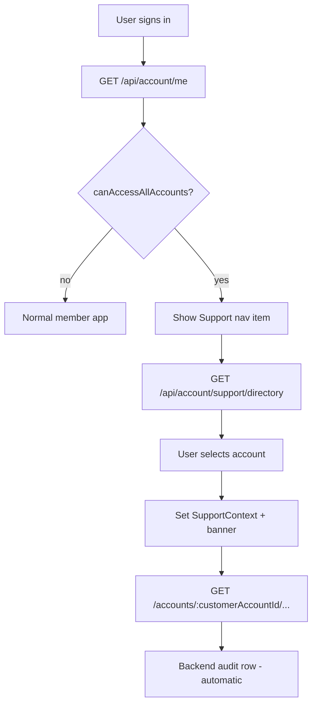

# CMS → App handoff: Support Super-User (Phase 5 integration)

**Date:** 2026-08-07
**Audience:** Fixtura **member app** frontend team (Next.js / customer-facing app)
**Not in scope:** Strapi CMS Admin UI (except where noted for ops granting access)
**Backend repo:** Fixtura Backend (this repository)
**Backend design docs:** [`docs/support-super-user-access.md`](../../../docs/support-super-user-access.md), [`docs/support-super-user-access-implementation-phases.md`](../../../docs/support-super-user-access-implementation-phases.md)

---

## TL;DR — App vs Admin

| Surface                            | Role                                                                                                                                                      |
| ---------------------------------- | --------------------------------------------------------------------------------------------------------------------------------------------------------- |
| **Fixtura member app** (your repo) | Where internal support staff sign in like any user and get a **Support View** — directory + read-only customer account screens. **Phase 5 is your work.** |
| **Strapi CMS Admin**               | Where ops enable `isSupportSuperUser` on a Users & Permissions **Client** record. Support staff do **not** use Admin to browse customer accounts in v1.   |
| **Backend API**                    | Authoritative security, directory, read routes, audit. **Phases 0–4 complete in this backend repo (local CMS).**                                          |

**Do not** call `GET /api/account/admin/lookup` — it returns **410 Gone** (`LEGACY_ADMIN_LOOKUP_REMOVED`).

### Backend readiness (local CMS)

**Phases 0–4 are implemented and available on the local CMS** — the same backend the member app already points at for development. No production deploy is required for Phase 5 integration work; start against local CMS once this backend is running with the latest code.

Production deploy of Phases 0–4 is a separate backend/ops step and is **not** a blocker for app development.

### Phase 5.1 billing reads (local CMS, 2026-08-07)

Support **billing summary** and **order history** reads are live on local CMS. Invoice-request **list**, **available-tiers**, and all billing **POST**s remain owner-only for support.

**Authoritative billing status:** [cms-reply-support-super-user-p0-billing-2026-08-07.md](./cms-reply-support-super-user-p0-billing-2026-08-07.md)

---

## Why we built this

Fixtura needs a **read-only support path** so authorised internal users can troubleshoot customer accounts without:

- A public “list all accounts + emails” endpoint
- Impersonating customers (no customer JWT, password, or session takeover)
- Automatic write access to billing, onboarding, media, sponsors, etc.

The member app already has rich account screens keyed by `accountId`. The backend now allows a verified **support super-user** to call the same **GET** endpoints for **any** account, while **mutations remain owner-only**.

---

## What backend has delivered (Phases 0–4)

### Phase 0 — Legacy lookup lockdown

- `GET /api/account/admin/lookup` → **410 Gone**, code `LEGACY_ADMIN_LOOKUP_REMOVED`
- **Action for app:** Remove any usage; use support directory instead.

### Phase 1 — Capability on `/me`

- User schema has private `isSupportSuperUser` (set only in Strapi Admin, never via registration/profile APIs).
- `GET /api/account/me` exposes a **derived** capability (not the raw DB flag):

```json
{
  "data": {
    "accountId": null,
    "user": {
      "id": 42,
      "username": "support@fixtura.com.au",
      "email": "support@fixtura.com.au",
      "confirmed": true,
      "blocked": false,
      "role": { "id": 1, "name": "Authenticated", "type": "authenticated" },
      "capabilities": {
        "canAccessAllAccounts": true
      }
    },
    "accounts": []
  }
}
```

**Rules for `canAccessAllAccounts === true`:**

- `isSupportSuperUser === true` (fresh DB check on backend for every support operation)
- `confirmed === true`
- `blocked === false`

**Important:** This flag is **UI gating only**. The backend re-checks support status on every directory/read request. Tampering with client state must not grant access.

**Support user with no owned account:** `/me` may return `accountId: null` and empty `accounts[]` — that is valid. Support View must not assume the user owns an account.

### Phase 2 — Support directory API

**Endpoint:**

```http
GET /api/account/support/directory
Authorization: Bearer <users-permissions-jwt>
```

**Auth matrix:**

| Caller                    | Result            |
| ------------------------- | ----------------- |
| No JWT                    | 401               |
| Normal authenticated user | 403 (`FORBIDDEN`) |
| Support super-user        | 200               |

**Query parameters:**

| Param          | Type    | Default          | Notes                                                                                                                   |
| -------------- | ------- | ---------------- | ----------------------------------------------------------------------------------------------------------------------- |
| `page`         | int     | 1                | Min 1                                                                                                                   |
| `pageSize`     | int     | 25               | Min 1, max **100**                                                                                                      |
| `search`       | string  | —                | Max **100** chars; searches account fields used in directory (name/org/email-related); **not** logged in audit raw form |
| `sport`        | string  | —                | One of: `Cricket`, `AFL`, `Hockey`, `Netball`, `Basketball`                                                             |
| `isActive`     | boolean | —                | `true` / `false` / `1` / `0`                                                                                            |
| `isSetup`      | boolean | —                | Same                                                                                                                    |
| `healthStatus` | string  | —                | `not_started`, `queued`, `running`, `completed`, `failed`                                                               |
| `sort`         | string  | `createdAt:desc` | Only `createdAt:asc` or `createdAt:desc`                                                                                |

**Success response (200):**

```json
{
  "data": [
    {
      "id": 575,
      "name": "Example Cricket Club",
      "ownerEmail": "owner@example.com",
      "accountType": "Club",
      "sport": "Cricket",
      "isActive": true,
      "isSetup": true,
      "onboardingStatus": "completed",
      "accountHealthStatus": "completed",
      "createdAt": "2024-03-15T10:00:00.000Z"
    }
  ],
  "meta": {
    "page": 1,
    "pageSize": 25,
    "total": 142,
    "totalPages": 6
  }
}
```

**Row field notes:**

- `name` — prefers `onboardingOrganisationName`, else `FirstName` + `LastName`
- `onboardingStatus` — derived headline: `completed` \| `failed` \| `in_progress` \| wizard status \| `not_started`
- `ownerEmail` — from linked user; treat as **PII** (support-only UI, not public)

**Headers:**

- Response: `Cache-Control: private, no-store` — do not cache in CDN/service worker for shared devices.

**Rate limit:**

- **60 requests / minute / support user** (in-memory, per backend instance)
- **429** with `Retry-After` header, body:

```json
{
  "data": null,
  "error": {
    "status": 429,
    "name": "TooManyRequestsError",
    "code": "RATE_LIMIT_EXCEEDED",
    "message": "Too many support directory requests. Please try again later.",
    "requestId": "req_..."
  }
}
```

### Phase 3 — Read routes for Support View

Support users (and owners) can **GET** the following for **any** `accountId`. Non-owner, non-support users get **404** (not 403) on account-scoped reads to avoid account ID enumeration.

**Base URL:** Same as existing account APIs (typically `/api/...` prefix depending on your client).

| Screen area                   | Method | Path                                                                                         |
| ----------------------------- | ------ | -------------------------------------------------------------------------------------------- |
| Account health                | GET    | `/account/:accountId/health/status`                                                          |
| Organisation dashboard        | GET    | `/account/organisation/:accountId`                                                           |
| Organisation (settings)       | GET    | `/accounts/:accountId/organisation`                                                          |
| Settings                      | GET    | `/accounts/:accountId/settings`                                                              |
| Notifications                 | GET    | `/accounts/:accountId/notifications`                                                         |
| Branding                      | GET    | `/accounts/:accountId/branding`                                                              |
| Scheduler                     | GET    | `/accounts/:accountId/scheduler`                                                             |
| Render list                   | GET    | `/accounts/:accountId/renders`                                                               |
| Render detail                 | GET    | `/accounts/:accountId/renders/:renderId`                                                     |
| Analytics overview            | GET    | `/accounts/:accountId/analytics/overview`                                                    |
| Media library                 | GET    | `/accounts/:accountId/media-library`                                                         |
| Media item                    | GET    | `/accounts/:accountId/media-library/:mediaId`                                                |
| Sponsors                      | GET    | `/accounts/:accountId/sponsors`                                                              |
| Sponsor entity targets        | GET    | `/accounts/:accountId/sponsor-entity-targets`                                                |
| Sponsor allocations (general) | GET    | `/accounts/:accountId/sponsors/:sponsorId/allocations/general`                               |
| Sponsor allocations (entity)  | GET    | `/accounts/:accountId/sponsors/:sponsorId/allocations/entity/:entityType/:entityId`          |
| Onboarding setup status       | GET    | `/accounts/:accountId/onboarding/setup-status`                                               |
| Onboarding state              | GET    | `/accounts/:accountId/onboarding/onboarding-state`                                           |
| Grade ordering                | GET    | `/accounts/:accountId/grade-ordering?organisationType=club\|association&organisationId=<id>` |

**Phase 5.1 billing reads (support on local CMS):**

| Method | Path                                                | Support                                                           |
| ------ | --------------------------------------------------- | ----------------------------------------------------------------- |
| GET    | `/api/accounts/:accountId/billing`                  | **200** — full parity with owner; includes `latestInvoiceRequest` |
| GET    | `/api/orders/account/:accountId`                    | **200** — via BFF `…/billing/orders`                              |
| GET    | `/api/accounts/:accountId/billing/invoice-requests` | **404** until Phase 5.1b                                          |
| GET    | `/api/accounts/:accountId/billing/available-tiers`  | **404** until Phase 5.1b                                          |
| POST   | All billing mutations                               | **404** for support on customer accounts                          |

See [cms-reply-support-super-user-p0-billing-2026-08-07.md](./cms-reply-support-super-user-p0-billing-2026-08-07.md).

**Explicitly NOT available to support in v1 (do not wire in Support View):**

| Reason          | Examples                                                                      |
| --------------- | ----------------------------------------------------------------------------- |
| Credential-like | `GET /accounts/:accountId/render-token`                                       |
| Billing (5.1b)  | Invoice-request list, available tiers                                         |
| Ops/global      | `GET /account/health/due`, aggregate health status, run status                |
| Deferred        | `GET /accounts/:accountId/club-logos-directory`, season-hub, template options |
| All mutations   | Every POST, PUT, PATCH, DELETE on customer accounts                           |

**Mutations:** Support users calling existing write endpoints (e.g. `PATCH /accounts/:accountId/settings`) still receive **404** / ownership errors — same as today for non-owners. **UI must hide/disable writes** in Support View; backend is the real enforcement.

**Grade ordering query:** Requires `organisationType` (`club` or `association`) and `organisationId` — same as the normal member app flow.

### Phase 4 — Audit logging (backend-only for app)

- Postgres table `support_access_audit_events` (Strapi Admin visibility only).
- Logged when a **support** user: browses directory, successfully reads an account screen, or certain rejections (e.g. directory 429).
- **Not exposed via member API** — no frontend work.
- Directory audit stores `searchPresent` + `searchLength` only, never raw search text.

---

## Phase 5 — Your implementation checklist

### 1. Detect support mode at login

After auth, call existing `GET /api/account/me`.

```ts
const canSupport = data.user?.capabilities?.canAccessAllAccounts === true;
```

- Show “Support” entry in nav **only** when true.
- Do **not** persist a separate “isSupport” flag in localStorage as authority — always re-read from `/me` on session bootstrap.

### 2. Support account directory (new UI)

**Suggested route:** `/support/accounts` (or `/support`).

- Paginated table/cards from `GET /api/account/support/directory`
- Search + filters matching query params above
- Debounce search (respect 60/min rate limit)
- Handle 403 gracefully (capability true in stale client state should not happen if `/me` is fresh; still handle 403)
- Row click → enter Support View for that `accountId`

### 3. Support View routing model

**Suggested pattern:**

```
/support/accounts                          → directory
/support/accounts/:accountId               → hub or redirect to default tab
/support/accounts/:accountId/settings      → mirror member settings **read**
/support/accounts/:accountId/branding      → etc.
```

**Critical:** Support View routes must pass the **selected customer `accountId`** from the URL into existing API clients — not the support user’s own `accountId` from `/me`.

Recommended app state:

```ts
type SupportContext = {
  active: boolean;
  customerAccountId: number | null;
  customerDisplayName: string | null; // from directory row
};
```

### 4. Persistent banner (required)

When `SupportContext.active`:

- Fixed banner: e.g. “Support view — Account 575 (Example Cricket Club) — Read only”
- **Exit support view** control → clears context, navigates to `/support/accounts` or user’s own home
- Banner visible on **every** support sub-route

### 5. Read-only UX (required)

For all screens under `/support/accounts/:accountId/...`:

- Hide or disable Save, Upload, Delete, Create, Reorder (PUT grade ordering), billing actions, onboarding writes, etc.
- Prefer reusing existing **read** components/data hooks with an `readOnly` or `mode: 'support'` prop
- If a screen mixes read + write, split or guard write sections

**Security note:** Disabled buttons are not security. Backend rejects mutations for non-owners. Still disable for clarity and to avoid support staff confusion.

### 6. Reuse existing API clients

Most Support View pages can call the **same GET endpoints** the member app already uses, substituting `:accountId` from the support route param.

Example:

```ts
// Normal member
GET /api/accounts/${myAccountId}/settings

// Support view
GET /api/accounts/${customerAccountId}/settings
```

No special support headers or query flags are required — authorization is entirely server-side from the JWT.

### 7. Error handling

| Status | Meaning in support context                                         |
| ------ | ------------------------------------------------------------------ |
| 401    | Session expired — re-login                                         |
| 403    | Directory only — not support (or revoked flag)                     |
| 404    | Account not found **or** no access — do not distinguish in UI copy |
| 429    | Directory rate limit — show retry message                          |

### 8. Screens to mirror (v1 minimum)

Prioritise screens support staff need for troubleshooting (product can reorder):

1. Settings + organisation + scheduler
2. Onboarding setup status + onboarding state
3. Branding + renders list/detail
4. Health status (`/account/:accountId/health/status` — note different path prefix)
5. Organisation dashboard (`/account/organisation/:accountId`)
6. Sponsors + entity targets (read-only lists)
7. Analytics overview, media library, grade ordering — as needed

### 9. What NOT to build in v1

- Customer impersonation / “login as user”
- Support write flows (Phase 7+ after security review)
- Billing **POST** actions in Support View (reads enabled in Phase 5.1 — see CMS reply doc)
- Render-token / club-logos directory in Support View
- Audit log viewer in app (Admin/ops only)
- Calling legacy admin lookup

### 10. Testing locally

1. In Strapi Admin → **Content Manager → [acc] Clients**, enable `isSupportSuperUser` on a test user.
2. Sign in to member app as that user.
3. Confirm `/me` → `canAccessAllAccounts: true`.
4. Open directory → pick an account you do **not** own.
5. Load settings/branding/etc. for that `accountId`.
6. Confirm mutation (e.g. save settings) **fails** with 404/forbidden behaviour.
7. Sign in as normal user → no support nav; directory returns 403.

---

## Suggested frontend architecture



**Provider placement:** Wrap authenticated layout with `SupportContextProvider` so banner + route guards are global.

**Route guard:** If path matches `/support/accounts/:id/*` but `canAccessAllAccounts` is false → redirect to home.

---

## Phase 6 — After frontend ships (shared)

Backend will:

- Remove legacy `GET /api/account/admin/lookup` permanently
- Finalise docs / ticket supersession

**App team:** Confirm zero references to admin lookup before Phase 6 deploy.

---

## Phase 7 — Later (not v1)

Explicit security review before **any** support mutation capability (edit settings on behalf of customer, billing actions, etc.). Do not pre-build write UI expecting it to work.

---

## Ops: granting support access (for QA / prod)

1. Strapi CMS Admin (not member app)
2. **Content Manager → [acc] Clients**
3. Edit internal user → enable **isSupportSuperUser** → Save
4. Revoke by setting flag back to `false` (no app deploy required)

---

## Backend contacts / references

| Topic              | Location                                                                                                                      |
| ------------------ | ----------------------------------------------------------------------------------------------------------------------------- |
| Design             | [`docs/support-super-user-access.md`](../../../docs/support-super-user-access.md)                                             |
| Phase status       | [`docs/support-super-user-access-implementation-phases.md`](../../../docs/support-super-user-access-implementation-phases.md) |
| Directory service  | `src/api/account/controllers/services/supportDirectory/`                                                                      |
| Read access helper | `src/api/account/controllers/services/security/supportSuperUser.js`                                                           |
| Audit              | `src/api/account/controllers/services/supportAccessAudit/`                                                                    |

---

## Backend FAQ (app team → CMS answers)

Authoritative as of Phases 0–4 in this repo (local CMS). Answers reflect **implemented behaviour**, not future wish-list.

### Scope and v1 screen parity

#### Season hub — intentionally out of v1

All `GET /api/season-hub/*` routes use `resolveSeasonHubScope`, which loads the account with `where: { id: accountId, user: userId }`. Support users get **404** on every season-hub route (same as any non-owner). This is **not an oversight** — season-hub was excluded from the Phase 3 manifest.

**v1 alternatives for fixture/competition/grade troubleshooting:**

| Need                | Endpoint                                                                              |
| ------------------- | ------------------------------------------------------------------------------------- |
| Account/org summary | `GET /api/account/organisation/:accountId`                                            |
| Org settings        | `GET /api/accounts/:accountId/organisation`                                           |
| Onboarding progress | `GET /api/accounts/:accountId/onboarding/setup-status`, `.../onboarding-state`        |
| Grade ordering      | `GET /api/accounts/:accountId/grade-ordering?organisationType=...&organisationId=...` |
| Pipeline health     | `GET /api/account/:accountId/health/status`                                           |
| Renders             | `GET /api/accounts/:accountId/renders`                                                |

Adding season-hub to support requires a **follow-up backend ticket** (wire scope resolution through `assertAccountReadAccess`, same pattern as Phase 3).

#### Template builder / template options — excluded from v1

| Route                                                             | Support today                                                        |
| ----------------------------------------------------------------- | -------------------------------------------------------------------- |
| `GET /api/template-categories/all-template-options?accountId=...` | **404** — `validateAccountOwnership`                                 |
| `PUT /api/template-option/put-template-options/:accountId`        | **404** — ownership in `putTemplateOptions`                          |
| `GET /api/template-categories/list-for-selection`                 | **200** — auth only; global published category list (no `accountId`) |

**Partial workaround:** `GET /api/accounts/:accountId/branding` (v1) includes `templateOptionId` and theme/template branding fields, but **not** the full template-builder catalog from `all-template-options`.

#### Club logos — nothing logo-related in v1

| Route                                               | Support today                                                       |
| --------------------------------------------------- | ------------------------------------------------------------------- |
| `GET /api/accounts/:accountId/club-logos-directory` | **404** — `loadScopedClubsMap` → owner-only `resolveSeasonHubScope` |
| Per-club upload/patch                               | **404** — same ownership path                                       |

There is **no separate “read one club logo” GET** outside the directory. Logo URLs only appear in the directory response (`logoUrl` per club). Explicitly deferred in the phases doc.

#### Notifications vs settings — not identical

`GET /api/accounts/:accountId/notifications` (v1, support-enabled) returns:

```json
{
  "data": {
    "bundleAddressedTo": "...",
    "deliveryEmail": "...",
    "assetDeliveryDay": "monday"
  }
}
```

(`assetDeliveryDay` from `scheduler.days_of_the_week`.)

`GET /api/accounts/:accountId/settings` returns account scalars including `FirstName`, `DeliveryAddress`, etc., but **not** `assetDeliveryDay`.

For notification prefs in Support View, call **`/notifications`**. If the app today reads delivery day only from settings, support mode should add **`/notifications`** (or **`/scheduler`**, which also exposes scheduler/day info).

#### Account health — path and response shape

**No BFF alias.** Call as-is:

```http
GET /api/account/:accountId/health/status
```

Note **`/account/`** (singular), not `/accounts/`.

**Response:** `{ data: { account, runCounts, latestRun, recentRuns } }` from `buildAccountStatus`:

- `data.account` — health scalars (`accountHealthStatus`, `accountHealthLastQueuedAt`, etc.)
- `data.runCounts` — counts by run status
- `data.latestRun` — full latest run detail
- `data.recentRuns` — summary list (id, status, timestamps, summary)

Reference: `src/api/account/.docs/admin/account-health-status-admin-handoff.md`

---

### API contract and behaviour

#### `capabilities` on `/me`

**Today:** only `{ canAccessAllAccounts: boolean }` inside `user.capabilities`.

**App rule:** treat unknown capability keys as **ignored** (forward-compatible). Never treat unknown keys as grants.

#### Support-only users (`accountId: null`, `accounts: []`)

Backend does **not** mandate a landing route — app/product UX decision.

Backend facts:

- `/me` with zero owned accounts is **valid** for support users.
- `/support/accounts` is the natural home for support-only staff.
- Member routes (`/o/:id/*`, org picker) are not API-forbidden, but fail or empty without an owned account.

**Recommendation:** if `canAccessAllAccounts`, redirect post-login to `/support/accounts`; hide or block `/select-organisation` and `/o/*` unless the user also owns accounts and explicitly switches to “My account”.

#### 404 vs 403

| Surface                                                                        | Non-support authenticated    | Support |
| ------------------------------------------------------------------------------ | ---------------------------- | ------- |
| `GET /api/account/support/directory`                                           | **403**                      | 200     |
| All 19 account-scoped reads (incl. `GET /api/account/organisation/:accountId`) | **404** if not owner         | 200     |
| Season hub, template options, club logos, render-token                         | **404** (owner-only loaders) | **404** |
| Billing summary + order history (Phase 5.1)                                    | **404** if not owner         | **200** |
| Billing invoice-request list, available-tiers (5.1b)                           | **404** if not owner         | **404** |

#### Error body shape — not fully uniform

| Route family                    | Shape                                                                                                                                                       |
| ------------------------------- | ----------------------------------------------------------------------------------------------------------------------------------------------------------- |
| Support directory 403/429       | `{ data: null, error: { status, name, code, message, requestId } }`                                                                                         |
| Account reads (404)             | Strapi `ctx.notFound("Account not found")` — typically `{ error: { status: 404, message: "Account not found" } }` — **no guaranteed `code` or `requestId`** |
| Mutations (e.g. PATCH settings) | `{ error: { code, message } }` with explicit status                                                                                                         |
| Season hub                      | `{ error: { code, message, details? } }` — `SEASON_HUB_*` codes                                                                                             |

**App guidance:** for support account reads, treat **404** as “no access or missing”. For directory, parse `error.code` and the **`Retry-After` header** on 429.

#### Directory filters

**Documented query params only:** `page`, `pageSize`, `search`, `sport`, `isActive`, `isSetup`, `healthStatus`, `sort`.

**No `onboardingStatus` filter** — response-only (derived in `mapSupportDirectoryRow`). Closest proxy: `isSetup=true` often correlates with `"completed"` onboarding.

#### Directory `ownerEmail`

- Returned as `account.user.email` or **`null`** (orphaned / no linked user).
- **No masking** in the API response.
- **Audit:** raw search text is not stored; only `searchPresent` + `searchLength`. `ownerEmail` is not written to audit rows.
- **App:** treat as PII; support-only UI.

#### Grade ordering

- Support **can GET**, **cannot PUT** (PUT uses `loadOwnedAccountContext` → 404).
- **Same query requirements as owner:** `organisationType=club|association` + `organisationId`.
- **No support shortcut** to return all orgs’ ordering in one call.

---

### Auth, permissions, and ops

#### Strapi permission for support directory

**Both:**

1. Authenticated role permission for `api::account.account.getSupportDirectory` — auto-enabled on bootstrap (`ensureAccountSupportDirectoryPermission` in `src/index.js`).
2. Handler enforces `isSupportSuperUser` — permission alone is **not** enough; normal users still get **403**.

#### Revocation timing

**Effective on the next API call**, not JWT expiry:

- Directory + reads: fresh DB check via `isSupportSuperUser` / `assertAccountReadAccess`.
- `/me`: reloads user row each request → `canAccessAllAccounts` updates on next bootstrap `/me`.

Existing JWT remains valid for authentication, but support operations stop immediately once the flag is cleared (or user blocked/unconfirmed).

#### Rate limit (60/min)

- In-memory, **per backend process**, per support user ID.
- Code comment: _“Single-instance CMS assumption; upgrade to Redis if multi-dyno.”_
- **Multi-instance prod:** effective limit is **~60 × instance count** until Redis is added.
- **App:** on 429, use **`Retry-After` response header**; body includes `error.code: "RATE_LIMIT_EXCEEDED"`.

---

### Implementation guidance for the app

#### Route architecture (`/support/...` vs `/o/...`)

**Backend has no preference.** Audit logs **`routeTemplate` from API paths** (e.g. `/accounts/:accountId/settings`), not the frontend URL. Use whichever UX is clearer; pass **customer `accountId`** from support route params into existing API clients.

#### Audit noise

**Audited (support only, success):**

- Every support directory request (each page = 1 row)
- Every successful support read on the Phase 3 manifest routes (1 row per HTTP GET)
- Phase 5.1 billing reads: `support.account.billing.summary.read` (`/accounts/:accountId/billing`), `support.account.billing.orders.list` (`/orders/account/:accountId`)

**Not audited:** owner reads; normal user traffic.

**Also audited:** support directory rejections and 429; account read rejections when caller is still a support user.

Expect **one audit row per support screen API call** — pagination = multiple directory rows.

#### Cache headers

| Route                                                           | Cache-Control                                    |
| --------------------------------------------------------------- | ------------------------------------------------ |
| Support directory                                               | `private, no-store`                              |
| Most v1 account reads (settings, branding, notifications, etc.) | **Not set**                                      |
| Render-token, club-logos                                        | `private, no-store` (not support v1 reads)       |
| Billing summary + orders (Phase 5.1)                            | `private, no-store` (support reads on local CMS) |

**App:** TanStack Query defaults are fine for v1 account reads; **do not cache directory**. Shorter `staleTime` in support mode is optional.

#### OpenAPI / example payloads

**No single Postman collection** for support flows today. Best references:

- This handoff doc + `docs/support-super-user-access-implementation-phases.md`
- `src/api/season-hub/.docs/frontend-handoff.md`
- `src/api/template-category/.docs/handoff-all-template-options.md`
- `src/api/account/.docs/admin/account-health-status-admin-handoff.md`

Edge cases: use real local accounts (inactive, failed onboarding, no theme) — no curated fixture pack yet.

---

### Confirming “do not build”

#### Billing, render-token, aggregate health ops

| Route                                                                         | Support user calling it                                                                                        |
| ----------------------------------------------------------------------------- | -------------------------------------------------------------------------------------------------------------- |
| `GET /api/accounts/:accountId/billing`                                        | **200** — Phase 5.1; full parity with owner GET                                                                |
| `GET /api/orders/account/:accountId` (BFF `…/billing/orders`)                 | **200** — Phase 5.1                                                                                            |
| `GET …/billing/invoice-requests`, `GET …/billing/available-tiers`             | **404** until Phase 5.1b                                                                                       |
| All billing POSTs on customer account                                         | **404** (`validateAccountOwnership`)                                                                           |
| `GET .../render-token`                                                        | **404** (queries `where: { id, user }`)                                                                        |
| `GET /api/account/:accountId/health/status`                                   | **200** — in v1                                                                                                |
| `GET /api/account/health/status`, `/health/due`, `/health/runs/:runId/status` | **200 for any authenticated user** — not blocked, but **exclude from Support View v1** (global ops aggregates) |

Account-scoped forbidden reads → **404**. Global health ops → **not 404**, but **out of Support View scope**.

#### Write attempts (e.g. `PATCH .../settings`)

For support on a customer account they do not own:

- **`404`** with `{ error: { code: "ACCOUNT_NOT_FOUND", message: "Account not found." } }` — **before** body validation.
- **Not 403** for ownership failures on mutations.

Support will not reach validation errors (400) on someone else’s account because the ownership lookup fails first.

**App copy:** show **“Read-only support view”** in the UI; accidental writes may return **404** (same anti-enumeration pattern as reads).

---

### v1 gaps backlog (if product needs them)

| Gap                                            | Status                                 |
| ---------------------------------------------- | -------------------------------------- |
| Billing invoice-request list + available-tiers | Phase **5.1b** — not ticketed yet      |
| Season hub reads                               | Deferred — needs Phase 3-style wiring  |
| Template builder (`all-template-options`)      | Deferred                               |
| Club logos directory                           | Deferred                               |
| Directory filter by `onboardingStatus`         | Not implemented — use `isSetup` filter |
| Uniform `error.code` on all 404s               | Not today                              |

---

## Open questions for app + product sync

1. **Default support landing tab** after picking an account (settings vs dashboard vs health).
2. **Nav placement** for “Support” (main nav, avatar menu, admin-only footer).
3. **Minimum v1 screen set** vs full parity with member account area.
4. **Support users who also own a personal account** — UX for switching between “My account” and “Support view”.

---

## Summary for product

- **Yes — this is the member Fixtura app**, not Strapi Admin.
- Backend provides **capability**, **directory**, **19 read APIs**, and **audit**.
- Frontend Phase 5 delivers **directory UI**, **support routes**, **banner**, and **read-only** mirroring of existing account screens using the same GET endpoints with the customer’s `accountId`.
