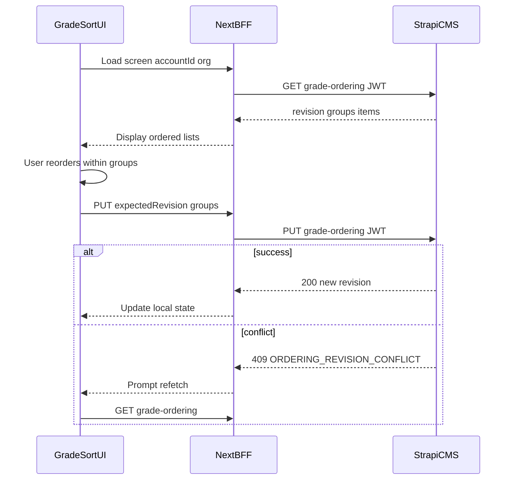

# CMS handoff — Account-scoped Grade ordering (Frontend)

**From:** CMS / Strapi backend  
**To:** Fixtura Application (frontend / BFF)  
**Date:** 2026-07-16  
**Contract:** [Grade Ordering API — Development Contract](../../../docs/api/grade-ordering-development-contract.md) (v1)  
**CMS checklist:** [grade-sorting-cms-development-checklist.md](../Monday.com/Grade%20Sorting%20Application/grade-sorting-cms-development-checklist.md)

---

## Summary

Grade ordering is now **Account-scoped**, **organisation-scoped** (one Club or one Association per request), and **revision-controlled**. The CMS returns a **fully normalized** list of Grades in display order — the frontend must **not** rebuild scope from raw Club / Team / Competition / Grade endpoints.

The legacy write endpoint **`POST /api/account/update-team-grade-order` is retired** and returns **`410 Gone`**. All new UI must use the member GET/PUT routes below.

Saved custom order is applied to **asset generation** via the same CMS resolver (scheduler path). Member GET order and generated bundle order should match after a successful save.

---

## Where CMS is up to (2026-07-16)

### Ready for frontend integration

| Area                                                | Status                                 |
| --------------------------------------------------- | -------------------------------------- |
| Legacy POST → `410 Gone`                            | Done                                   |
| `GET /api/accounts/:accountId/grade-ordering`       | Done — JWT required                    |
| `PUT /api/accounts/:accountId/grade-ordering`       | Done — JWT required                    |
| Optimistic concurrency (`expectedRevision` / `409`) | Done                                   |
| Club grouping (Junior / Senior / Masters / Other)   | Done — CMS-derived                     |
| Association grouping (by Competition CMS ID)        | Done                                   |
| Fallback order for unsaved / new Grades             | Done — uses provider `Grade.sortOrder` |
| Permissions bootstrap (`authenticated` role)        | Done — auto-seeded on CMS boot         |
| Scheduler uses same resolved order                  | Done — internal only                   |

### Not ready / still outstanding on CMS side

| Area                                      | Notes                                                                                     |
| ----------------------------------------- | ----------------------------------------------------------------------------------------- |
| Staging GET/PUT sample payloads           | Not captured yet (P07)                                                                    |
| Formal Application sign-off               | Pending                                                                                   |
| Full integration test suite               | Concurrency / PG tests still to add                                                       |
| External scheduler caller contract update | Worker must send `accountId` + `organisation` (not FE concern unless BFF calls scheduler) |

### Feature flag (writes)

PUT is gated by env var **`ENABLE_GRADE_ORDERING_PUT`**.

- Unset or `true` → PUT enabled (default in dev)
- `false` / `0` / `off` → PUT returns **403** with error payload

GET is always available when authenticated.

---

## Authentication

Both member routes require **Users & Permissions JWT** (same as other `/api/accounts/:accountId/*` routes).

Strapi permission actions (enabled for `authenticated` on bootstrap):

- `api::account.account.getGradeOrdering`
- `api::account.account.putGradeOrdering`

If a user gets **403 Forbidden** despite a valid JWT, check Strapi Admin → Settings → Users & permissions → Authenticated → Account.

Forward the member JWT from the BFF; do not use the internal CMS token for these routes.

---

## Organisation context (required)

Each Account may relate to **multiple** Clubs and Associations. Every GET/PUT must specify **which organisation** is being edited:

```ts
type OrganisationType = "club" | "association";

interface GradeOrderingOrganisationRef {
  type: OrganisationType;
  id: number; // CMS Club or Association ID
}
```

**How to obtain IDs**

- `GET /api/account/me` — selected Account id
- `GET /api/accounts/:accountId/organisation` — org type + linked org details (for display / picker)

The grade-ordering GET response also includes `organisation.type`, `organisation.id`, and `organisation.name` for confirmation.

**Validation**

- Account must be owned by the authenticated user
- Organisation must be linked to that Account
- Missing/unowned Account → **404** `ACCOUNT_NOT_FOUND`
- Missing/unrelated organisation → **404** `ORGANISATION_NOT_FOUND` (same shape — no enumeration)

---

## Endpoints

### 1. Load ordering (read)

```http
GET /api/accounts/:accountId/grade-ordering?organisationType=club|association&organisationId=<id>
Authorization: Bearer <member-jwt>
```

**Response headers:** `Cache-Control: private, no-store`

**Success:** `200` — body `{ data: GradeOrderingResponseData }`

Key fields:

| Field                      | Meaning                                                            |
| -------------------------- | ------------------------------------------------------------------ |
| `contractVersion`          | Always `1` for this release                                        |
| `revision`                 | `0` if user never saved; increment on each successful PUT          |
| `groups[]`                 | CMS-derived sections (Club age groups or Association competitions) |
| `groups[].items[]`         | Grades in **final display order**                                  |
| `items[].savedPosition`    | User-defined position, or `null` if fallback-ordered               |
| `items[].resolvedPosition` | Zero-based index in the group (use for UI order)                   |
| `items[].isCustomOrdered`  | `true` if user has saved position for this Grade                   |
| `items[].sourceTeamIds`    | Club only — Teams that reach this Grade (deduped, sorted)          |
| `generatedAt`              | ISO timestamp                                                      |

**First load:** `revision: 0`, all items typically `isCustomOrdered: false`, order is provider fallback.

**Do not** call separate Grade/Team/Competition APIs to build this screen.

---

### 2. Save ordering (write)

```http
PUT /api/accounts/:accountId/grade-ordering
Authorization: Bearer <member-jwt>
Content-Type: application/json
```

**Request body:**

```json
{
  "expectedRevision": 0,
  "organisation": {
    "type": "club",
    "id": 123
  },
  "groups": [
    {
      "groupType": "club-age-group",
      "groupKey": "junior",
      "gradeIds": [10, 18, 12]
    }
  ]
}
```

**Rules the UI must follow**

1. Send **`expectedRevision`** from the last successful GET or PUT.
2. Send **`gradeIds` in array order** — order is the saved position (0-based).
3. Include **`groupType` and `groupKey` exactly as returned by GET** for each group you update.
4. **Full replacement** for reachable Grades:
   - Grades omitted from a group’s array → revert to fallback order for that group
   - Groups omitted from PUT → cleared for reachable Grades in those groups
   - `groups: []` → clears all custom order (revision still advances)
5. **Do not send:** `position`, labels, `scopeKey`, `orderingKey`, `accountId` in body, ordering maps, provider sort values.

**Success:** `200` — same shape as GET, with new `revision` (first save: `0` → `1`).

**Conflict:** `409` `ORDERING_REVISION_CONFLICT` — another tab/user saved first.

```json
{
  "data": null,
  "error": {
    "status": 409,
    "name": "ConflictError",
    "code": "ORDERING_REVISION_CONFLICT",
    "message": "Grade ordering has changed since it was loaded.",
    "requestId": "req_...",
    "details": {
      "expectedRevision": 7,
      "currentRevision": 8
    }
  }
}
```

**Required UX on 409:** Refetch GET, show conflict message, let user review and save again. Do not retry PUT with the stale revision.

---

### 3. Legacy endpoint (removed)

```http
POST /api/account/update-team-grade-order
```

**Always returns `410 Gone`:**

```json
{
  "data": null,
  "error": {
    "status": 410,
    "name": "GoneError",
    "code": "LEGACY_ORDERING_ENDPOINT_REMOVED",
    "message": "This ordering endpoint is no longer available.",
    "requestId": "req_..."
  }
}
```

**Migration notes for old integration** (`API_update-team-grade-order-FRONTEND.md` is obsolete):

| Old                                      | New                                                                            |
| ---------------------------------------- | ------------------------------------------------------------------------------ |
| `accountType: "Club"` + Team IDs         | Organisation `type: "club"` + **Grade** IDs in groups                          |
| `accountType: "Association"` + Grade IDs | Organisation `type: "association"` + Grade IDs under `competition:{id}` groups |
| No revision                              | `expectedRevision` required                                                    |
| Wrote global `sortOrder` on Team/Grade   | CMS-owned ordering records only                                                |

---

## Group shapes

### Club accounts

| `groupType`      | `groupKey`     | Label   |
| ---------------- | -------------- | ------- |
| `club-age-group` | `junior`       | Junior  |
| `club-age-group` | `senior`       | Senior  |
| `club-age-group` | `masters`      | Masters |
| `club-age-group` | `unclassified` | Other   |

- Groups appear in fixed order: junior → senior → masters → unclassified
- Empty groups are **omitted** from GET
- If Account setting **`split_seniors_and_masters`** is not `true`, Masters Grades are merged into **senior** group in GET/PUT

### Association accounts

| `groupType`   | `groupKey`                       | Label            |
| ------------- | -------------------------------- | ---------------- |
| `competition` | `competition:{competitionCmsId}` | Competition name |

- Identity is **Competition CMS ID**, not name (names can duplicate)
- `competition` object on each group includes metadata for display

Account setting **`group_assets_by`** affects how downstream **assets are grouped**, not the GET group list. Ordering within each competition group still applies.

---

## Error codes (member routes)

| HTTP | Code                         | When                                               |
| ---- | ---------------------------- | -------------------------------------------------- |
| 400  | `INVALID_ACCOUNT_ID`         | Bad path id                                        |
| 400  | `INVALID_QUERY`              | GET query missing/invalid                          |
| 400  | `INVALID_PAYLOAD`            | PUT body structurally invalid                      |
| 401  | `UNAUTHENTICATED`            | Missing/invalid JWT                                |
| 403  | —                            | PUT disabled via `ENABLE_GRADE_ORDERING_PUT=false` |
| 404  | `ACCOUNT_NOT_FOUND`          | Not owned or missing                               |
| 404  | `ORGANISATION_NOT_FOUND`     | Not linked or missing                              |
| 409  | `ORDERING_REVISION_CONFLICT` | Stale revision                                     |
| 422  | `DUPLICATE_GROUP`            | Same group key twice in PUT                        |
| 422  | `DUPLICATE_GRADE_ID`         | Grade listed more than once                        |
| 422  | `GRADE_NOT_IN_ORGANISATION`  | Grade not reachable in scope                       |
| 422  | `GRADE_GROUP_MISMATCH`       | Grade in wrong group vs CMS derivation             |
| 422  | `INVALID_GROUP`              | Bad group type/key                                 |
| 500  | `INTERNAL_ERROR`             | Unexpected failure                                 |

All errors use:

```ts
{
  data: null;
  error: {
    status: number;
    name: string;
    code: string;
    message: string;
    requestId: string | null;
    details?: Record<string, unknown>;
  };
}
```

---

## Recommended frontend flow



1. Resolve `accountId` (from session / `GET /api/account/me`).
2. Resolve organisation picker (from `GET /api/accounts/:accountId/organisation` if multiple orgs).
3. **GET** grade-ordering → render groups and items by `resolvedPosition`.
4. On save, build PUT payload from current UI order:
   - Copy `groupType` / `groupKey` from GET
   - Set `gradeIds` to ordered CMS Grade IDs per group
   - Set `expectedRevision` from last GET/PUT
5. On **409**, refetch GET and merge/reprompt.

**Caching:** Respect `Cache-Control: private, no-store` — do not cache ordering responses in CDN or long-lived client cache.

---

## UI implementation hints

- **Drag-and-drop scope:** Reorder only within a single `groupKey` (cross-group moves are invalid unless CMS reclassifies the Grade).
- **Unsaved Grades:** Show fallback-ordered items (`isCustomOrdered: false`) — they still appear in GET; saving assigns custom order only to Grades you include in PUT arrays.
- **New imports:** After data import, refetch GET — new Grades appear at fallback positions without wiping saved order on others.
- **Multi-tab:** Two tabs saving the same revision → one wins, one gets 409.
- **Club Teams:** Use `sourceTeamIds` for display/debug only; ordering is by **Grade**, not Team.

---

## BFF checklist

- [ ] Remove all calls to `POST /api/account/update-team-grade-order`
- [ ] Add proxy routes or server actions for GET/PUT grade-ordering
- [ ] Forward `Authorization: Bearer <member-jwt>`
- [ ] Pass through `organisationType` + `organisationId` query params on GET
- [ ] Handle 409 with refetch guidance to UI
- [ ] Do not cache responses (`no-store`)
- [ ] TypeScript types aligned with contract v1 (`docs/api/grade-ordering-development-contract.md` §5)

---

## Local dev

**Permissions:** Restart CMS after pull so bootstrap seeds grade-ordering permissions.

**Env (optional):**

```bash
# Disable PUT while testing read-only UI
ENABLE_GRADE_ORDERING_PUT=false
```

**Example GET (curl):**

```bash
curl -sS \
  -H "Authorization: Bearer $MEMBER_JWT" \
  "http://localhost:1337/api/accounts/575/grade-ordering?organisationType=club&organisationId=123"
```

**Example PUT (curl):**

```bash
curl -sS -X PUT \
  -H "Authorization: Bearer $MEMBER_JWT" \
  -H "Content-Type: application/json" \
  -d '{"expectedRevision":0,"organisation":{"type":"club","id":123},"groups":[{"groupType":"club-age-group","groupKey":"junior","gradeIds":[10,18]}]}' \
  "http://localhost:1337/api/accounts/575/grade-ordering"
```

Replace Account, organisation, and Grade IDs with owned test data.

---

## Open items / questions for FE ↔ CMS

1. **Staging samples** — CMS will provide redacted GET/PUT/409 examples when staging IDs are confirmed (P07).
2. **Organisation picker** — If Account has multiple Clubs or Associations, confirm UX for selecting `organisationId`.
3. **Empty states** — GET may return zero groups if no published Grades are reachable; confirm UI copy.
4. **Sign-off** — Reply when BFF + UI types match contract v1 so we can close P07.6.

---

## References

| Doc               | Path                                                                                     |
| ----------------- | ---------------------------------------------------------------------------------------- |
| Full API contract | `docs/api/grade-ordering-development-contract.md`                                        |
| CMS dev guide     | `.comms/Monday.com/Grade Sorting Application — CMS LLM Development Guide.md`             |
| CMS checklist     | `.comms/Monday.com/Grade Sorting Application/grade-sorting-cms-development-checklist.md` |
| Obsolete FE doc   | `src/api/account/.docs/API_update-team-grade-order-FRONTEND.md`                          |
