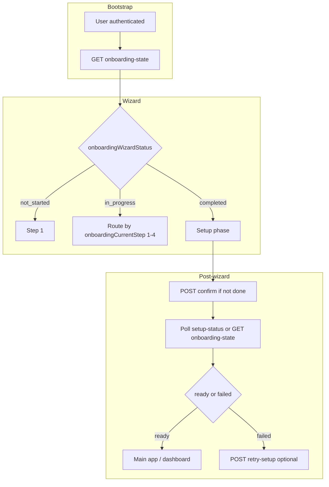

# App handoff — Onboarding lifecycle v1 (integration guide)

**From:** CMS / Strapi backend  
**To:** Fixtura App (frontend / BFF)  
**Purpose:** Single integration guide for the two-milestone onboarding model: **wizard complete** vs **initial account setup / data fetch complete**.

**Related product decisions:** [answers.md](./answers.md)  
**CMS implementation notes:** [cms-work-onboarding-lifecycle-v1.md](./cms-work-onboarding-lifecycle-v1.md)

---

## 1. What changed (summary)

Onboarding is no longer a single “done” flag. The backend now exposes:

1. **Wizard lifecycle** — progress through steps, completion of the form, timestamps.
2. **Initial setup + initial data fetch** — separate status fields for background work after the user confirms the wizard.

The app should **treat `GET .../onboarding/onboarding-state` as the primary bootstrap / resume payload** after the user picks an account (or on cold start). Use **`GET .../onboarding/setup-status`** for **lightweight polling** while setup runs (it includes a simplified `phase` / `status` plus the new enum fields).

**Important:** Background workers may still be evolving how `initialSetupStatus` / `initialDataFetchStatus` move from `queued` → `running` → `completed` / `failed`. The **headline** for “is the account ready?” remains **`isSetup`** (and legacy `phase` / `status` on setup-status) until product confirms otherwise.

---

## 2. Auth and base URL

All routes below require the **same JWT** as existing account onboarding routes (e.g. `Authorization: Bearer <token>`).

- **Path pattern (Strapi):** routes are registered under the account API prefix. In production this is typically:
  - **`{STRAPI_BASE_URL}/api/accounts/:accountId/onboarding/...`**
- Replace `{STRAPI_BASE_URL}` with your environment (e.g. BFF proxy to Strapi or direct Strapi URL).

If your app uses a BFF, mirror these paths under your BFF (same path segments are recommended).

---

## 3. Permissions (CMS Admin)

The **Authenticated** role in Strapi must allow the new Account actions (same place you enabled `confirmOnboarding`, `getOnboardingSetupStatus`, etc.):

| Action                                      | Used for                                       |
| ------------------------------------------- | ---------------------------------------------- |
| `api::account.account.getOnboardingState`   | `GET .../onboarding/onboarding-state`          |
| `api::account.account.retryOnboardingSetup` | `POST .../onboarding/retry-setup`              |
| `api::account.account.restartOnboarding`    | `POST .../onboarding/restart` (v1 returns 403) |

Existing `updateOnboardingStep1`, `confirmOnboarding`, `getOnboardingSetupStatus`, etc. are unchanged.

---

## 4. Concepts — two milestones

| Milestone                          | Meaning                                                        | Primary fields                                                                                                          |
| ---------------------------------- | -------------------------------------------------------------- | ----------------------------------------------------------------------------------------------------------------------- |
| **Wizard complete**                | User finished the onboarding form and confirm succeeded.       | `onboardingWizardStatus === "completed"`, `hasCompletedOnboardingWizard`, `onboardingWizardCompletedAt`                 |
| **Account ready (setup complete)** | Backend initial setup + required initial data fetch succeeded. | `isSetup === true`, `initialSetupStatus === "completed"`, `initialDataFetchStatus === "completed"` (intended alignment) |

Do **not** treat wizard complete as “account fully ready.” After confirm, the user should see **setup in progress** until `isSetup` / `setup-status` says ready.

---

## 5. Step numbering (canonical)

Use this mapping everywhere (resume, analytics, deep links):

| `onboardingCurrentStep` | Screen                                 |
| ----------------------- | -------------------------------------- |
| `0`                     | Not started                            |
| `1`                     | Organisation (step 1)                  |
| `2`                     | Branding (step 2)                      |
| `3`                     | Contact / delivery (step 3)            |
| `4`                     | Review / confirm (before POST confirm) |

After successful **POST confirm**, the backend sets **`onboardingCurrentStep` to `4`** and **`onboardingWizardStatus` to `completed`** — completion is **not** a separate step number.

---

## 6. Endpoints — when to call what

| When                                               | Method               | Path                                                   | Purpose                                                                                                                                      |
| -------------------------------------------------- | -------------------- | ------------------------------------------------------ | -------------------------------------------------------------------------------------------------------------------------------------------- |
| After login / account switch / app resume          | **GET**              | `/api/accounts/:accountId/onboarding/onboarding-state` | **Single source of truth** for wizard + setup + fetch flags. Drive navigation and “continue vs setup vs dashboard.”                          |
| **Optional** lightweight poll after wizard confirm | **GET**              | `/api/accounts/:accountId/onboarding/setup-status`     | Polling-friendly `phase` / `status` + enums. Stop when `status === "ready"` or `status === "failed"`.                                        |
| Saving step 1                                      | **PATCH**            | `/api/accounts/:accountId/onboarding/step-1`           | Unchanged; success body now **may include** lifecycle fields (see §8).                                                                       |
| Saving step 2 (theme / branding)                   | **POST** / **PATCH** | `/step-2/theme`, `/step-2`, etc.                       | Unchanged; success body **may include** lifecycle fields.                                                                                    |
| Saving step 3                                      | **PATCH**            | `/.../step-3`                                          | Unchanged; success body **may include** lifecycle fields.                                                                                    |
| User taps “Confirm” on review                      | **POST**             | `/api/accounts/:accountId/onboarding/confirm`          | Marks wizard complete, sets `initialSetupStatus` to **`queued`**, queues backend job; returns **lifecycle** + `onboardingWizardCompletedAt`. |
| Setup failed and user taps “Retry”                 | **POST**             | `/api/accounts/:accountId/onboarding/retry-setup`      | Only allowed when setup or fetch failed; re-queues and resets failure fields.                                                                |
| “Restart onboarding” (v1)                          | **POST**             | `/api/accounts/:accountId/onboarding/restart`          | **403** `ONBOARDING_RESTART_BLOCKED` — do not surface as primary UX in v1.                                                                   |

**Recommendation:** Call **`onboarding-state`** on entry; after **confirm**, navigate to setup UI and **poll `setup-status`** (or re-fetch `onboarding-state` if you prefer one payload). **Headline** progress for users should follow **`initialSetupStatus`** (see [answers.md](./answers.md)); **`initialDataFetchStatus`** is secondary detail.

---

## 7. TypeScript-style types (DTOs)

### 7.1 `GET .../onboarding/onboarding-state` — `data` object

```json
{
  "data": {
    "accountId": 123,
    "onboardingWizardStatus": "in_progress",
    "onboardingCurrentStep": 2,
    "onboardingLastCompletedStep": 1,
    "onboardingStartedAt": "2026-04-08T12:00:00.000Z",
    "onboardingLastActivityAt": "2026-04-08T12:05:00.000Z",
    "hasCompletedOnboardingWizard": false,
    "onboardingWizardCompletedAt": null,
    "initialSetupStatus": "not_started",
    "initialSetupStartedAt": null,
    "initialSetupCompletedAt": null,
    "initialSetupFailedAt": null,
    "initialSetupFailureReason": null,
    "initialDataFetchStatus": "not_started",
    "initialDataFetchStartedAt": null,
    "initialDataFetchCompletedAt": null,
    "initialDataFetchFailedAt": null,
    "initialDataFetchFailureReason": null,
    "isSetup": false,
    "isUpdating": false,
    "isActive": false
  }
}
```

```ts
type OnboardingWizardStatus = "not_started" | "in_progress" | "completed";

type InitialPipelineStatus = "not_started" | "queued" | "running" | "completed" | "failed";

export type OnboardingStateResponse = {
  accountId: number;
  onboardingWizardStatus: OnboardingWizardStatus;
  /** 0–4 — see §5 */
  onboardingCurrentStep: number;
  onboardingLastCompletedStep: number;
  onboardingStartedAt: string | null;
  onboardingLastActivityAt: string | null;
  hasCompletedOnboardingWizard: boolean;
  onboardingWizardCompletedAt: string | null;

  initialSetupStatus: InitialPipelineStatus;
  initialSetupStartedAt: string | null;
  initialSetupCompletedAt: string | null;
  initialSetupFailedAt: string | null;
  initialSetupFailureReason: string | null;

  initialDataFetchStatus: InitialPipelineStatus;
  initialDataFetchStartedAt: string | null;
  initialDataFetchCompletedAt: string | null;
  initialDataFetchFailedAt: string | null;
  initialDataFetchFailureReason: string | null;

  isSetup: boolean;
  isUpdating: boolean;
  isActive: boolean;
};
```

**404:** account not found or not owned by the user.

---

### 7.2 `GET .../onboarding/setup-status` — `data` object (polling)

```ts
export type SetupStatusPhase = "wizard" | "preparation" | "complete";

export type SetupStatusPollStatus = "in_progress" | "ready" | "failed";

export type OnboardingSetupStatusResponse = {
  phase: SetupStatusPhase | null;
  status: SetupStatusPollStatus;
  requiresUserAction: boolean;
  errorCode: string | null;
  progress: { syncing?: boolean } | null;

  initialSetupStatus: InitialPipelineStatus;
  initialDataFetchStatus: InitialPipelineStatus;
  isSetup: boolean;
  isUpdating: boolean;
};
```

**Semantics (v1):**

- `phase === "wizard"` — wizard not finished (`onboardingWizardCompletedAt` absent).
- `phase === "preparation"` — wizard done, setup not complete yet (or failed).
- `phase === "complete"` + `status === "ready"` — `isSetup === true` (terminal; **stop polling**).
- `status === "failed"` — `errorCode === "SETUP_FAILED"` when `initialSetupStatus` or `initialDataFetchStatus` is `failed` (see CMS implementation).

---

### 7.3 `POST .../onboarding/confirm` — success `data`

On first success, `data` includes at least:

- `accountId`, `onboardingWizardCompletedAt`, `alreadyConfirmed: false`
- Plus the **same lifecycle fields** as in `OnboardingStateResponse` (minus `accountId` duplication is fine — the API returns `accountId` once).

If already confirmed:

- `alreadyConfirmed: true`, `onboardingWizardCompletedAt`, plus lifecycle fields.

**Errors:** same as before (`WIZARD_INCOMPLETE`, etc.) — `{ error: { code, message } }` with HTTP 4xx.

---

### 7.4 Step PATCH/POST success bodies

Successful step saves **may** merge lifecycle fields into `data` (same names as in `OnboardingStateResponse` where applicable). **Do not require** the client to parse them if you already call `onboarding-state` after save; they are there to avoid an extra GET in simple flows.

---

### 7.5 `POST .../onboarding/retry-setup`

**Success** `200`: `{ data: { accountId, ...lifecycle fields } }` (same shape as onboarding-state snippet).

**Errors:**

| HTTP | `error.code`        | When                                   |
| ---- | ------------------- | -------------------------------------- |
| 404  | `ACCOUNT_NOT_FOUND` | Invalid / not owned account            |
| 409  | `RETRY_NOT_ALLOWED` | Neither setup nor fetch is in `failed` |

---

### 7.6 `POST .../onboarding/restart`

**403:**

```json
{
  "error": {
    "code": "ONBOARDING_RESTART_BLOCKED",
    "message": "Restarting onboarding is not available for this account in the current release."
  }
}
```

Do not build a “restart onboarding” flow in v1 against this endpoint.

---

## 8. Integration flow (recommended)



### 8.1 Resume rules (must match backend)

1. **`onboardingWizardStatus === "not_started"`** → start wizard at step 1.
2. **`in_progress`** → resume at **`onboardingCurrentStep`** (1–4).
3. **`completed`** and setup not **ready** (`isSetup === false` or setup-status not `ready`) → **setup / preparation UI** — do **not** send the user back into wizard steps unless product explicitly adds restart later.
4. **`isSetup === true`** (and typically `setup-status.status === "ready"`) → main app.

Derive **navigation in the app** from these fields (see [answers.md](./answers.md) — backend does not return a “next UI action” string).

---

## 9. Polling (after confirm)

Recommended (from product decisions):

- Poll every **10–15 s** while `initialSetupStatus` is `queued` or `running` (or while `setup-status.status === "in_progress"` and `phase === "preparation"`).
- Back off to **30–60 s** after a few minutes if still not complete.
- **Stop** when `setup-status.status === "ready"` or **`failed`**, or when `onboarding-state` shows `isSetup === true` / failure.

Use **`initialSetupStatus`** as the **headline**; show **`initialDataFetchStatus`** as secondary detail if needed.

---

## 10. `GET /api/account/me` (optional)

Bootstrap may still use **`GET /api/account/me`** for `accountId` and account list. **New lifecycle fields are not required** on `me` if you call **`onboarding-state`** immediately after selecting an account. If you want fewer round-trips, a future BFF change could embed a subset; **not** part of this CMS release requirement.

---

## 11. QA checklist (app)

- [ ] Cold start: `onboarding-state` loads and routes correctly for not started / in progress / wizard complete + setup running / ready / failed.
- [ ] Step save: optional lifecycle fields merge into client state; no stale step index after refresh (re-fetch `onboarding-state`).
- [ ] Confirm: wizard complete + transition to setup UI; **no** false “dashboard ready” before `isSetup`.
- [ ] Polling stops on ready or failed.
- [ ] Retry: only offered when `setup-status` / `onboarding-state` indicates failure; **409** on invalid retry handled gracefully.
- [ ] Restart endpoint **403** not treated as a user-facing bug.

---

## 12. Support / CMS follow-ups (not app)

- **Workers** continue to align `initialSetupStatus` / `initialDataFetchStatus` with real job progress.
- **One-time backfill** on existing DBs may have been run in each environment — old accounts may not have had new fields until then.

---

## 13. Document index

| Doc                                                                                                            | Role                                           |
| -------------------------------------------------------------------------------------------------------------- | ---------------------------------------------- |
| [answers.md](./answers.md)                                                                                     | Product decisions (v1)                         |
| [cms-work-onboarding-lifecycle-v1.md](./cms-work-onboarding-lifecycle-v1.md)                                   | CMS deliverables                               |
| [app-onboarding-lifecycle-finish-states-and-resume.md](./app-onboarding-lifecycle-finish-states-and-resume.md) | Original app UX spec (align with this handoff) |
| This file                                                                                                      | **App integration contract**                   |
