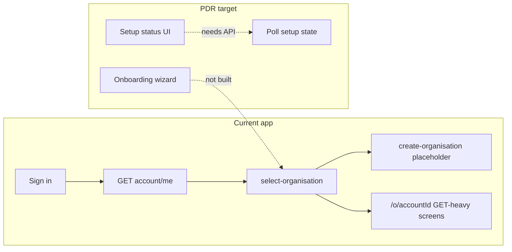

# Fixtura Onboarding — UI / Frontend PDR

This document is for **product, frontend, and backend** alignment. It is structured in four layers:

1. **Part 1 — Product and UX** — What the experience is and why (mostly independent of current implementation).
2. **Part 2 — Frontend architecture** — How to build it (patterns, stack, components).
3. **Part 3 — Current codebase alignment** — What exists in the members app today, provisional API mapping, gaps, and open questions.
4. **Part 4 — Implementation strategy** — **Contract-first** delivery order: data and API contracts before UI.

---

# Part 1 — Product and UX

## Overview

Onboarding is the **guided setup experience** for a signed-in user in the Fixtura members area. It establishes **organisation identity and permission first**, collects **minimum brand and contact details**, supports **review and confirmation**, and makes clear that **backend preparation may continue** after the visible wizard ends.

This part stays **product-led**. Implementation-specific paths and types live in Part 3; **contract-first delivery order** is in Part 4.

---

## Product goal

The onboarding flow helps the user to:

1. **Identify their organisation** and confirm authority to act for it.
2. **Grant permission** for Fixtura to fetch and prepare organisation data (the unlock for background work).
3. Provide **essential brand and contact** details (minimum to operate the account).
4. **Review and confirm** before entering normal app use.
5. **Understand** that preparation may continue in the background after the wizard finishes.

The account is the **canonical root** for persisted setup. The backend may still be **1:1 user–account** today but is expected to move toward **multiple accounts per user**. The frontend should stay **account-scoped**: treat onboarding as configuration of an **active account context**, not a single global “user profile” state.

**Who it is for**

- New signed-in users and users who have not finished required setup.
- Users whose account is still in an onboarding or setup-in-progress state.

**Out of scope (for this PDR)**

- Multi-account switching UX, invites, teams, deep template/theme customisation, and full post-onboarding admin (those are separate features).

---

## Core UX concept

> Tell us who your organisation is and confirm you want Fixtura to prepare your data.  
> While we fetch and prepare that in the background, finish the rest of your setup.  
> Then review and confirm your details while we continue preparing your organisation.

The wizard is **not** responsible for waiting until all backend work finishes. It should:

- collect essential inputs;
- start backend preparation **early** (after permission);
- keep the user informed via a **setup status** surface;
- allow **visible completion** of the wizard before **full operational readiness**.

---

## Primary user sequence (org-first mental model)

The **headline story for users** should be:

1. **Identify the organisation** (who we are setting up).
2. **Grant permission** (authority + consent to fetch/prepare data).
3. **Queue backend fetch/preparation** as soon as permission is confirmed.
4. **Continue the visible wizard** (branding, contact, review) **while** backend work runs in parallel.

**Account records and IDs** may be created, attached, or updated **behind the scenes** when Step 1 succeeds. That is an implementation detail: the **user-facing narrative** should not centre on “creating an account shell first.” Prefer language about **organisation**, **permission**, and **getting your data ready**.

---

## UX principles

### Account-scoped, not user-scoped

Model **authenticated viewer**, **active account**, and **onboarding/setup status** per account. Do not assume one account per user forever, or that onboarding “belongs” only to the user object.

### Fast visible progress

Heavy work should **not** block the visible path unless unavoidable. The user should feel that setup is **moving** and that Fixtura is **working for them**, not that they are stuck in an opaque import.

### Wizard complete vs setup complete

These differ:

| Concept             | Meaning                                                                                                    |
| ------------------- | ---------------------------------------------------------------------------------------------------------- |
| **Wizard complete** | User finished all **visible** steps; required inputs saved and confirmed.                                  |
| **Setup complete**  | **Backend** preparation has reached a **ready** (or clearly **blocked**) state for normal operational use. |

The UI must communicate when the organisation is **still being prepared**, when **some features are not ready**, and that **Fixtura is still working in the background**. This is a core product requirement.

### Minimise initial burden

Only what is needed to operate the account. Defer theme defaults, template deep configuration, and broad media management to post-onboarding.

### Confidence and trust

Copy should be **calm, clear, explicit** about what Fixtura does and why—especially around permission and authority.

---

## Final user flow

### Get Started (entry)

Pre-stepper screen: orient the user, set expectations (including background preparation), primary CTA **Get Started**. Copy should reflect the **org-first** sequence above—not a generic “create your account” story.

### Step 1 — Organisation identification + permission

**Goal:** Identify the organisation and capture **explicit permission/authority** to begin backend data preparation.

**Fields (conceptual):** sport, organisation type, organisation name, confirmations for data fetch and for acting on behalf of the organisation.

**Why first:** This is the **unlock**. On success, the backend can **establish or attach account and organisation context** (including **creating the first account** when the user has none), **save identity**, and **queue** fetch/preparation. Wording in UI should emphasise **organisation + permission**, not “creating an account” as the hero concept.

**Submission result (conceptual):** Organisation details persisted; background job queued; onboarding moves to **setup-in-progress** from a product perspective.

### Step 2 — Branding

Minimum visual identity (e.g. logo, colours). **Out of scope here:** theme selection, template defaults, advanced styling, broad media management. This step is a good parallel track while background fetch runs.

### Step 3 — Contact / delivery details

Primary **operational** contact for the account (not a generic social profile). Framing: who owns operational communication for this account.

### Step 4 — Review and confirm

Summarise organisation, permission, branding, and contact. Reinforce that **data may still be preparing**. On confirm: **wizard complete**; route into the **authenticated app** (see Part 2 for **v1 route strategy**) and show **setup-in-progress** UI until backend reaches a terminal state.

---

## Background setup lifecycle

After Step 1, the backend may queue work (e.g. jobs), fetch organisation or competition data, validate data, and advance readiness. The frontend **must not** assume this finishes before the user completes later steps or lands in the app.

---

## Setup status component

A dedicated, **persistent** surface—not a bare spinner—that explains what Fixtura is doing during preparation.

**Purpose:** Progress, explanation, whether **user action** is required, and blocked vs in-progress states.

**Where it may appear:** After Step 1, on review, on post-wizard landing, and anywhere the account is not yet fully ready.

**Example messages (illustrative):** preparing organisation, fetching competition data, validating, almost ready, needs attention.

**Style:** Calm messaging, cards/banners, gentle progress; avoid opaque “processing” or internal job/queue jargon.

**Visibility recommendation:** Keep “setup in progress” visible **after Step 1**, on **Review**, **after onboarding completes**, and until backend setup reaches a **terminal** ready or blocked state.

---

# Part 2 — Frontend architecture

## Recommended v1 route strategy

For v1, the FE team should aim for:

- A **dedicated onboarding route** under the **authenticated** members area (not the same shell as the full `/o/[accountId]/…` app chrome, unless product explicitly wants that).
- **One onboarding layout** and **one stepper** with **internal step state** (minimises route explosion).
- **Redirect into `/o/[accountId]/…`** only once **visible** onboarding is complete (exact gating rules depend on CMS—see Part 3).

This keeps onboarding **focused** and separates it from normal account navigation until the user is ready for the scoped app.

---

## Conceptual state model

Model **account-scoped** setup. Illustrative states (need not match backend enums on day one):

`not_started` → `org_identified` / `fetch_queued` / `fetch_in_progress` → `wizard_in_progress` → `wizard_complete` → `awaiting_backend_setup` → `ready` or `setup_issue`.

---

## Stepper behaviour

Prefer **one layout** with **internal step navigation** and a persistent progress indicator. Support next, back, validation before advance, and **safe persistence** of values. Design for **reload/resume** from server state where possible.

**Progress UI:** Simple step count, current label, completed steps; optional line about background preparation—avoid an overly long or clinical stepper.

---

## Transitions and motion

Use subtle **fade/slide** between steps, soft progress updates, submission microstates, and appearance of setup status after Step 1. Avoid playful or distracting motion; tone stays **trustworthy**.

---

## Frontend architecture (core split)

| Layer                | Responsibility                                                  |
| -------------------- | --------------------------------------------------------------- |
| **Local form state** | Editing, dirty state, validation UX before save.                |
| **Server state**     | Persisted onboarding data, setup status—use **TanStack Query**. |

Recommended: **React Hook Form** (or equivalent) + **Zod** (if aligned with app conventions).

---

## TanStack Query strategy

- **Setup status is server state** — fetch and optionally **poll** while preparation is active; stop at terminal states. Do not fake completion client-side.
- **Step-scoped mutations** — one mutation boundary per step (clear loading/error/retry, cleaner analytics).
- **Hydrate from server** — on refresh or return visits, derive step/progress from persisted data where possible.
- **Optimistic UI** — light optimism for step transitions only; **not** for backend readiness or fetch success.

Illustrative query concepts: `account.me`, `onboarding.status`, `setup.status`. Illustrative mutations: `saveOrganisationStep`, `saveBrandingStep`, `saveContactStep`, `confirmOnboarding`—actual paths depend on CMS.

---

## Practical recommendation (onboarding shell)

Strong default approach:

1. **One authenticated onboarding route**, **one layout shell**, **one stepper**, and **one account-scoped controller hook** (e.g. orchestrating step index + server sync).
2. **TanStack Query** for bootstrap context, **onboarding/setup status**, **step mutations**, **invalidation after each step**, and **conditional polling** once background fetch begins.
3. **Local form state** for editing, validation, dirty flags, and light optimistic **step** transitions only.
4. Keep **setup-in-progress UI** visible per the Setup status component section in Part 1.

---

## Validation

- **Step 1:** Sport, org type, org name, both permission checklists—**blocking**.
- **Step 2:** Pragmatic logo/colour rules; do not over-validate brand.
- **Step 3:** Name + valid email (or whatever product mandates).
- **Step 4:** Confirmation that required data exists before finishing the wizard.

---

## Errors and edge cases

- **Step errors:** Inline errors, retry, **preserve field values** on failure.
- **Background errors:** Distinct **blocked / needs attention** state on the setup status surface—not the same as field validation.
- **Partial completion:** User may finish the wizard while backend is still running—banner, disable fragile features, keep polling or opportunistic refresh.
- **Resume later:** Prefer inferring position from **server** state, not only client memory.

---

## Components (illustrative names)

- Shell: `OnboardingLayout`, `OnboardingStepper`, `OnboardingProgress`
- Screens: `GetStartedScreen`, `OrganisationStep`, `BrandingStep`, `ContactDetailsStep`, `ReviewStep`
- Shared: `SetupStatusCard`, `StepActions`, `StepHeader`, `OnboardingSummaryBlock`
- Hooks: `useOnboardingState`, `useSetupStatus`, `useOnboardingNavigation`, `useOnboardingMutations`

Names are not mandatory.

---

## Post-onboarding behaviour

After **wizard complete**, route into the authenticated app; if backend is still running, keep **setup-in-progress** experience. Defer theme, template defaults, and expanded media to **settings** or later flows.

---

## UX recommendations (summary)

- Keep the step count **small and meaningful**; make **Step 1** feel **consequential** (permission and identity).
- Prefer a **real setup status** over a vague spinner.
- **Reload/resume** from day one.
- Stay **account-scoped** for future multi-account support.

---

# Part 3 — Current codebase alignment

This section ties the PDR to the **members app under `src/`** as of the date below. It does **not** replace a signed CMS/API contract.

## As-of and scope

- **As of:** 2026-04-07 (Australia/Sydney calendar date for doc maintenance).
- **Scope:** Codebase snapshot + negotiation list for BFF/CMS. Field semantics for Strapi-backed flags remain **provisional** until backend confirms.

---

## What exists today

- **Gateway (no account id in path):** After sign-in, users use **select-organisation** (`GET /api/account/me` via `useAccountMe`); **create-organisation** exists as a page. Legacy flat member URLs redirect to the gateway (`middleware.ts`).
- **Account-scoped app:** Primary UI under **`/o/[accountId]/…`** (`account-routes.ts`, `accountScopedRoutes`).
- **Read-heavy account API:** `accountApi` and `queryKeys.account.*` cover bootstrap (`account.me`), settings, branding, organisation context, scheduler, renders, billing, media library, sponsors, etc. (`route-definitions.ts`, `account.api.ts`, `query-keys.ts`).
- **Partial setup signals on DTOs:** e.g. `AccountSettingsData` includes `isSetup`, `hasCompletedStartSequence`, `isPermissionGiven`, `isUpdating`; `AccountSummary` on `GET /api/account/me` may include `isSetup`, `isActive`, org slices.

---

## What does not exist yet

- **No onboarding wizard UI** — no dedicated Get Started → steps flow; component names in Part 2 are illustrative.
- **`create-organisation` is a placeholder** — no self-serve create API wired in-app; users are directed to selection or support until a contract exists.
- **No onboarding mutations in the app layer** — `account.api.ts` is effectively read-only for account resources; typical mutations today are auth (`useLogin` / `useLogout`).
- **No first-class setup/onboarding status route** in `route-definitions.ts` for polling (nothing like `setup.status` / `onboarding.status`).
- **No middleware/layout guard** forcing incomplete onboarding before `/o/[accountId]/…` (e.g. dashboard is not gated on wizard completion).

---

## Critical implementation risk — unconfirmed backend flags

Some existing fields **look** relevant to onboarding gating (e.g. `hasCompletedStartSequence`, `isSetup`, `isUpdating` on settings, `isSetup` on account summary). **Their exact semantics are not confirmed in this document.**

**FE must not hard-code onboarding routing, redirects, or “completion” logic against these fields until CMS/backend explicitly signs off** on meaning, transitions, and which field drives **hard navigation** vs **banner-only** UX.

Treat the mapping table below as **discovery only**, not a specification.

---

## Provisional mapping: PDR steps ↔ existing types and GET routes

All rows are **provisional** — confirm with CMS before relying on them for **any** gating.

| PDR area                               | Likely existing sources (today)                                                                                                                                                     | Notes                                                                                                                             |
| -------------------------------------- | ----------------------------------------------------------------------------------------------------------------------------------------------------------------------------------- | --------------------------------------------------------------------------------------------------------------------------------- |
| **Gateway / account pick**             | `GET /api/account/me` → `AccountMePayload.accounts[]` / `AccountSummary`                                                                                                            | Rows include `id`, optional `accountOrganisationDetails` (`Name`, `Sport`, etc.), `isSetup`, `isActive`, `Sport`, `account_type`. |
| **Step 1 — Organisation + permission** | `GET /api/accounts/:accountId/settings` → `AccountSettingsData.isPermissionGiven`, `isRightsHolder`; `GET /api/accounts/:accountId/organisation` → `AccountOrganisationContextData` | **Sport / org name** mapping is **TBD** vs new fields.                                                                            |
| **Step 2 — Branding**                  | `GET /api/accounts/:accountId/branding` → `AccountBrandingData`                                                                                                                     | Endpoint carries template/theme; product decides what onboarding **writes** vs defers.                                            |
| **Step 3 — Contact**                   | `GET /api/accounts/:accountId/settings` → `FirstName`, `LastName`, `DeliveryAddress`; user email via `GET /api/auth/me` or `AccountMePayload.user`                                  | Canonical contact email is an **open question** (Part 3).                                                                         |
| **Step 4 — Review**                    | Aggregate of the above GETs                                                                                                                                                         | No single review endpoint; optional dedicated read model later.                                                                   |
| **Wizard vs setup complete (flags)**   | `hasCompletedStartSequence`, `isSetup`, `isUpdating`; `AccountSummary.isSetup`                                                                                                      | See **Critical implementation risk** above.                                                                                       |

---

## API contract gaps

Negotiation list until reflected in `route-definitions.ts` and BFF routes.

**Read**

- [ ] **Setup / onboarding status** — Machine-readable state for the setup-status UI: phase, user-action-required, error/blocked, terminal ready; supports **polling** with clear stop conditions.
- [ ] Optional: **single read model** for review to avoid N+1 client fetches.

**Write**

- [ ] **Persist onboarding steps** — Step-scoped or orchestrated API; align with step-scoped mutations in Part 2.
- [ ] **Establish account / organisation context** for users with **no** `accounts[]` row — server path for “first account” / attach (today **create-organisation** has no API; see `.comms/archives/18-FIXTURA_MULTI_ORGANISATION_ROUTE_LOGIC.md`). This is a **backend capability**, not the user-facing headline.

**Media**

- [ ] **Logo / branding assets** — Confirm existing CMS branding flows vs dedicated onboarding upload contract.

---

## Open questions

1. **Semantics:** Exact meaning of `hasCompletedStartSequence` vs `isSetup` vs `isUpdating` vs Part 1 “wizard complete” / “setup complete”? Which drive **routing** vs **banner-only** UX? (Blocked until CMS sign-off—see **Critical implementation risk**.)
2. **Routing:** Align **Part 2 v1 route strategy** (dedicated onboarding route + redirect to `/o/[accountId]/…` after visible completion) with gateway: where do **zero-account** users enter onboarding vs `create-organisation`?
3. **Blocking vs soft:** Hard-redirect until onboarding done vs partial app access + persistent banner for v1?
4. **Permission:** Is `isPermissionGiven` sufficient for Step 1 confirmations, or are additional persisted flags required?
5. **Contact email:** Canonical email = user only, account field, or both?

---

## Implementation notes

- Follow **Part 2** v1 route strategy: one layout, internal steps, redirect to scoped app when product + CMS allow.
- Reuse `queryKeys.account.*`, `accountApi`, hooks under `src/lib/api/hooks/account/`, `route-definitions.ts`.
- Add mutations and invalidation per `/.skills/api-data-layer-patterns.md` when write contracts exist.
- After mutations, invalidate relevant queries (`account.me`, `account.settings`, `account.organisationContext`, branding, etc.) so reload/resume works.

---

# Part 4 — Implementation strategy

This section defines **delivery order** for onboarding. It complements Part 2 (patterns) and Part 3 (current gaps): execution should follow **contracts before screens**.

## Key direction

Deliver onboarding in **contract-first order**, not UI-first:

1. **Identify** all onboarding data requirements (discovery).
2. **Define and implement** required CMS schema and CRUD/API endpoints (backend is the source of truth).
3. **Integrate** those endpoints into the app **data layer** and API protocols (BFF routes, client, hooks).
4. **Build the onboarding UI** only after contracts and the protocol layer are in place.

## Why this matters

The UI must not be built against **unvalidated assumptions**. Onboarding depends on real contracts for:

- **Selectable / reference data** (dropdowns, lookups, hierarchies).
- **Persisted onboarding fields** (permission, org identity, branding, contact).
- **Onboarding progress / completion state** (what the server considers saved or done).
- **Setup status reads** for background preparation (polling, terminal states).
- **Branding / media writes** (e.g. logo upload paths and permissions).
- **Review / summary reads** (single aggregate vs composed GETs—decide explicitly).

Skipping these steps produces throwaway UI, duplicate work, and fragile client-only state.

---

## Phase 1 — Identify required data

Inventory **all** data the flow needs before API design:

- **Reference / lookup:** sport options, organisation types, associations, clubs, and any other picklists or trees.
- **Optional product scope:** theme or catalog items **only if** product commits them to onboarding (Part 1 defers much of this—confirm).
- **Persisted fields:** permission and authority flags, organisation fields, branding fields, contact/delivery fields.
- **State:** onboarding progress, step completion, wizard vs backend readiness, **setup status** fields for background preparation.

Output of this phase should be a **single agreed data matrix** (field list + ownership + required/optional) shared by product, CMS, and FE.

---

## Phase 2 — Define CMS/API contract

Translate Phase 1 into explicit API design:

- **Lookup endpoints** for selectable/reference data (caching and invalidation rules as needed).
- **Write endpoints** for onboarding data — default recommendation is **step-scoped persistence** (save per step with clear semantics), not **only** one final all-at-once submission unless product explicitly chooses that model.
- **Read / status endpoints** for onboarding and **setup** state (machine-readable, poll-friendly).

Document payloads, errors, idempotency expectations, and how flags map to Part 1 concepts (wizard complete vs setup complete).

---

## Phase 3 — Implement CMS/backend support

Implement and verify on the server:

- Schema / field updates and **required relations** between entities.
- Lookup endpoints.
- Onboarding **write** endpoints (step-scoped or orchestrated, per Phase 2).
- **Setup status** read endpoints (and job/progress semantics if applicable).
- **Branding / logo upload** support (or explicit delegation to existing media/branding pipelines).
- **Confirmed meaning** of setup/completion-related flags (align with Part 3 **Critical implementation risk** — no FE guessing).

---

## Phase 4 — Integrate into the app data layer

Only after backend behaviour is stable enough to integrate:

- **Route definitions** (`route-definitions.ts` or equivalent) and BFF routes.
- **API client methods** (`account.api.ts` / dedicated onboarding service as appropriate).
- **Query keys** and **TanStack Query** hooks (queries + mutations).
- **Invalidation / refetch rules** after each step mutation.
- **Polling** for setup status while non-terminal.
- **Upload handling** where needed (progress, errors, size/type rules).

Follow `/.skills/api-data-layer-patterns.md` and existing account patterns (Part 2, Part 3).

---

## Phase 5 — Build the UI

Build **visible** onboarding **after** the data/API layer is demonstrably working (happy path + key error paths):

- Onboarding **route** and **layout** (aligned with Part 2 v1 route strategy).
- **Stepper shell** and **steps** (organisation, branding, contact, review).
- **Setup status UI** wired to server state (not client-only spinners).
- **Review** flow and **completion routing** (redirect to `/o/[accountId]/…` per product + Part 2).
- **Resume / re-entry** behaviour driven by server state where possible.

---

## Final recommendation

- **Backend / API first** — schema and endpoints are the contract.
- **App protocol layer second** — routes, client, query keys, mutations, polling, uploads.
- **UI last** — stepper and screens once contracts are trustworthy.
- **Step-scoped persistence preferred** unless product standardises on a single submit.
- **Setup status is server state** — fetch, poll, and stop on terminal states; do not invent readiness in the client.

---

# Definition of success

Onboarding succeeds when:

- Users can **identify the organisation** and **grant permission** quickly.
- **Background preparation starts** without blocking visible progress.
- Required setup is **calm and clear**.
- The UI **clearly separates wizard complete from full setup readiness**.
- The app **survives refresh and re-entry**.
- Architecture stays **account-scoped** and does not lock the product into a permanent **user-only** mental model.
