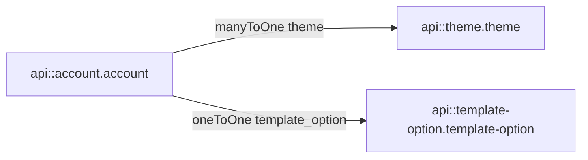

# CMS / backend response — Phase 3: `api::theme.theme`, premade list, custom themes, logo

**Audience:** Members app / BFF integrators  
**Date:** 2026-04-07  
**Re:** [cms-request-onboarding-phase3-themes-and-logo.md](./cms-request-onboarding-phase3-themes-and-logo.md)

## 1. `api::theme.theme` — fields and types

| Field (Strapi) | Type     | Notes                                                                                                                                                  |
| -------------- | -------- | ------------------------------------------------------------------------------------------------------------------------------------------------------ |
| `Name`         | string   | Human-readable name.                                                                                                                                   |
| `Theme`        | JSON     | Product/render tokens; **no** JSON schema checked in this backend repo — treat as contract between CMS editors and render/FE.                          |
| `isPublic`     | boolean  | **Primary** machine flag for “in the global premade catalogue” vs “not listed publicly”. Exact product rules (default, required) should be documented. |
| `CreatedBy`    | integer  | Present on schema; usage is legacy/optional — do not assume it equals “account owner” for private themes.                                              |
| `accounts`     | relation | **One theme → many accounts** (`oneToMany`, mapped by `account.theme`).                                                                                |

**Publishing:** Content-type has `draftAndPublish: true`. Catalogue entries should be **published** for typical “live only” REST reads.

**Branding read shape today:** `GET …/branding` returns theme as `{ id, name, theme }` where `name` ← `Name`, `theme` ← `Theme` JSON (`buildThemeBranding` in `getAccountBrandingPayload`).

## 2. Premade vs custom — how they differ (recommended semantics)

|                               | Premade / catalogue                       | Custom / private                                                                                     |
| ----------------------------- | ----------------------------------------- | ---------------------------------------------------------------------------------------------------- |
| **`isPublic`**                | `true`                                    | `false`                                                                                              |
| **Listed in Step 2 dropdown** | Yes (via filtered list endpoint)          | No                                                                                                   |
| **Linked to account**         | Same as custom: set `account.theme`       | Same                                                                                                 |
| **Reuse**                     | Intentionally shared across many accounts | Product should decide: one account per private row (enforce in API) vs shared private rows (unusual) |

**Important:** The schema allows **multiple accounts** on one theme row. “Account-only” custom themes need **explicit validation** (or schema addition) if that is a hard requirement.

## 3. Endpoint to get all public / premade themes

**Today (no custom onboarding route):** Standard Strapi collection API, e.g. filter themes with `filters[isPublic][$eq]=true` and `publicationState=live` (exact query shape follows Strapi v4 REST rules and project policies).

**Gap vs request doc:** There is **no** dedicated `GET /api/account/onboarding/lookups/themes` in this codebase yet (unlike sports / organisation-types lookups). Options:

- **A)** Add a **slim custom route** (stable DTO: `id`, `slug` if you add it, `label`/`Name`, `sortOrder` if you add it) — matches the illustrative contract in the request doc.
- **B)** Rely on **filtered `GET /api/themes`** and document filters + fields for the BFF to proxy.

**Not equivalent:** `GET …/all-template-options` aggregates **template-option** and related template-\* entities — it does **not** include `api::theme.theme`. Extending that aggregate to embed themes is a **separate product decision** (your open Q1).

## 4. Creating a new theme and associating it to an account

1. **Create** a theme document with `isPublic: false`, plus `Name` and `Theme` JSON as required (`POST` to themes collection — permissions must allow the authenticated user or a server-only path).
2. **Link:** Update the account’s `theme` relation to the new theme id (`manyToOne` on `account`).

**Optional workshop items:** Maximum custom themes per account; whether to set `CreatedBy` to a stable id; whether `Theme` JSON uses `{ primary, secondary, dark, white }` consistently across premade and custom themes.

## 5. W2 / Step 2 persistence (alignment with existing model)

Minimum alignment with current schema:

- **Premade selection:** `theme` id pointing at a row with `isPublic: true`.
- **Custom selection:** `theme` id pointing at a row with `isPublic: false`.

The request doc’s split `premadeThemeId` / `customThemeId` can be **simplified** to a single `themeId` on the server if only one relation exists — or keep both for FE clarity with validation that exactly one mode is active.

## 6. Logo and images

**Account model:** No dedicated `logo` media field on `api::account.account` in the current schema.

**Existing media path:** `account-media-library` rows tie **media** (`imageId`) to an account with optional `tags` JSON — possible interim pattern if product assigns a tag like `logo` / `branding`.

**Handoff requirement** ([cms-handoff-onboarding-api-requirements.md §4.6](../../../.comms/cms-handoff-onboarding-api-requirements.md)): CMS should choose **one** sequence: (a) upload returns **media id** → W2 references it, or (b) **single** multipart branding step. Until a field exists on `account` (or agreed library convention), logo persistence for onboarding is **undefined in schema** — needs explicit CMS decision.

## 7. Open questions (for workshop / next iteration)

1. Add **`slug`** / **`sortOrder`** on `theme` for stable FE keys and ordering, or derive order from `id`/`Name` only?
2. Single **`themeId`** vs **`premadeThemeId` + `customThemeId`** in W2 payload?
3. Enforce **at most one private theme per account** (or per user) in API?
4. Logo: **new `account.logo` media relation** vs **tagged `account-media-library`** row vs **field inside `Theme` JSON**?

## Diagram (account relations)

## Implementation status (members app)

| Item              | Status                                                                                                                                                                                               |
| ----------------- | ---------------------------------------------------------------------------------------------------------------------------------------------------------------------------------------------------- |
| Premade list      | **Option A** — BFF `GET /api/account/onboarding/lookups/themes` → Strapi `GET …/account/onboarding/lookups/themes` (see [phase3-implementation-decisions.md](./phase3-implementation-decisions.md)). |
| W2 `themeId`      | Members app sends **`themeId`** on `PATCH …/onboarding/step-2`; Strapi must accept and set `account.theme`.                                                                                          |
| Custom theme POST | BFF `POST /api/accounts/[accountId]/onboarding/step-2/theme` proxies Strapi; UI enabled when upstream exists.                                                                                        |
| Logo              | Placeholder in onboarding UI until schema decision ([§6–7](#6-logo-and-images)); M1 BFF ready.                                                                                                       |

## Document history

| Date       | Change                                                                       |
| ---------- | ---------------------------------------------------------------------------- |
| 2026-04-07 | Initial backend review from Strapi schemas and branding/template code paths. |
| 2026-04-07 | Implementation status + cross-link to phase3-implementation-decisions.       |
