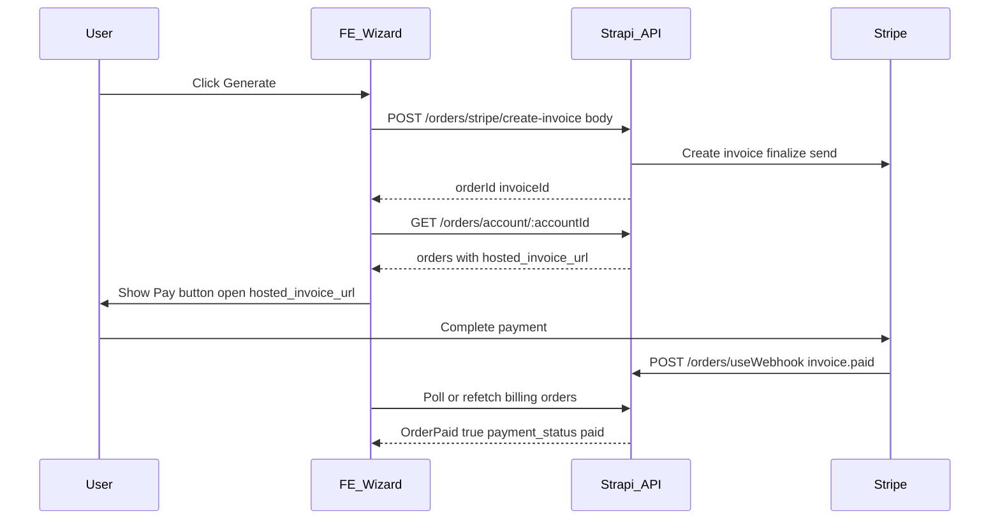

# Planning: FE wizard — Generate (Stripe invoice + order)

**Date:** 2026-05-07
**Audience:** Frontend (wizard flow)
**Related handoff:** [.comms/stripe/handoff/cms-handoff-payonline-stripe-invoice-webhook-flow.md](../cms-handoff-payonline-stripe-invoice-webhook-flow.md)

## Goal

From the wizard, the user has **Account**, **subscription type (tier)**, **start/end dates**, and **display price**. A **Generate** action should:

1. Ask the backend to create a **Stripe invoice** and a **CMS order** for that account/tier/dates.
2. Obtain the **hosted invoice URL** so the user can pay on Stripe.
3. After payment, rely on **webhooks** to mark the order paid and update entitlement (FE refreshes state from the API).

---

## Backend contract (what FE calls)

### Step A — Generate invoice + order

| Item                 | Value                                                                                                                               |
| -------------------- | ----------------------------------------------------------------------------------------------------------------------------------- |
| **Method**           | `POST`                                                                                                                              |
| **Path (canonical)** | `/api/orders/stripe/create-invoice`                                                                                                 |
| **Auth**             | JWT with scope **`api::order.order.createStripeInvoice`** (staff-only in current routes)                                            |
| **Deprecated alias** | `POST /api/orders/createInvoice` with scope **`api::order.order.createInvoice`** — same body and behaviour until FE migrates off it |

**Request body** (field names are case-sensitive):

| Field        | Type             | Required | Notes                                                                                            |
| ------------ | ---------------- | -------- | ------------------------------------------------------------------------------------------------ |
| `AccountID`  | number \| string | Yes      | CMS account id                                                                                   |
| `product_id` | number \| string | Yes      | **Subscription tier id** (not Stripe price id). Backend resolves `stripe_price_id` from tier row |
| `startDate`  | string           | Yes      | Persisted as `order.startOrderAt`                                                                |
| `endDate`    | string           | Yes      | Persisted as `order.endOrderAt`                                                                  |
| `couponId`   | string \| null   | No       | Stripe coupon id if applying a discount                                                          |

**Price display in wizard:** FE may show price for UX only. **Do not send price** to this endpoint unless the backend is extended — amount comes from Stripe via the tier’s `stripe_price_id`.

**Success response** (shape):

```json
{
  "message": "Invoice sent and order created successfully",
  "invoiceId": "in_...",
  "customerId": 123,
  "orderId": 456
}
```

The response **does not** include `hosted_invoice_url`. That URL is stored on the **order** after finalize/send.

### Step B — Load payment link

After Step A returns `orderId`:

| Item       | Value                                                                                   |
| ---------- | --------------------------------------------------------------------------------------- |
| **Method** | `GET`                                                                                   |
| **Path**   | `/api/orders/account/:accountId`                                                        |
| **Auth**   | JWT with scope **`api::order.order.getOrdersByAccount`** (member ownership rules apply) |

Find the order matching `orderId` (newest first if needed). Read:

- **`hosted_invoice_url`** — open this for **Pay online**
- **`invoice_pdf`** — optional PDF link
- **`payment_status`**, **`OrderPaid`** — until paid, expect unpaid/open states

**Alternative:** If staff tooling cannot call member-scoped routes, align with backend on a staff-safe read (e.g. admin order detail) — **decision required** (see Open questions).

---

## Operations (Strapi Admin)

After backend deploy, enable **`createStripeInvoice`** on the staff role (**Settings → Users & Permissions → Roles → Order → createStripeInvoice**). Until then, **`POST /orders/stripe/create-invoice` returns 403**. Full steps: [cms-handoff-payonline-stripe-invoice-webhook-flow.md § Operations](../cms-handoff-payonline-stripe-invoice-webhook-flow.md).

---

## FE wizard flow (recommended sequence)



1. Validate wizard fields locally (account id, tier id, dates).
2. **POST** `/orders/stripe/create-invoice` with body above; handle **401/403** if the JWT role lacks **`createStripeInvoice`** (legacy: **`createInvoice`** on `/orders/createInvoice`).
3. On success, **GET** orders for account; locate `orderId` from Step A; read **`hosted_invoice_url`**.
4. Show **Pay online** (opens `hosted_invoice_url` in same tab or new tab — product choice).
5. After user returns from Stripe, **refetch** orders and/or **GET** account billing summary so UI shows paid state when webhook has run.
6. Treat **`OrderPaid === true`** and **`payment_status === 'paid'`** as completion signals; **`isActive`** may still be false if `startOrderAt` is in the future.

---

## Error handling (FE)

| Situation                             | FE behaviour                                                                                                                     |
| ------------------------------------- | -------------------------------------------------------------------------------------------------------------------------------- |
| Missing `stripe_price_id` on tier     | Backend/Stripe may fail; show generic error and surface CMS tier configuration issue                                             |
| `403` on create endpoint              | Grant **`createStripeInvoice`** for canonical route (or **`createInvoice`** if still using legacy path); staff-only scopes apply |
| No `hosted_invoice_url` after success | Retry GET orders once; invoice finalize may lag slightly                                                                         |
| User pays but UI still unpaid         | Webhook delay — poll orders/billing briefly; do not mark paid client-side                                                        |

---

## Open questions (resolve before implementation)

1. **Who uses the wizard?** Staff-only vs member self-serve determines whether these order endpoints are sufficient or an account-scoped route is needed.
2. **How does staff read `hosted_invoice_url`?** If staff JWT cannot call **`GET /orders/account/:accountId`**, specify an alternative (admin order by id, or extend create response to include URL — backend change).
3. **Coupon:** Confirm whether the wizard will ever pass **`couponId`** and where valid coupons are defined (Stripe Dashboard).

---

## References (code)

- Route: [src/api/order/routes/custom-routes.js](../../../../src/api/order/routes/custom-routes.js) — `POST /orders/stripe/create-invoice`, `POST /orders/createInvoice` (alias), `GET /orders/account/:accountId`
- Controller: [src/api/order/controllers/order.js](../../../../src/api/order/controllers/order.js) — `createStripeInvoice`, `createInvoice` (deprecated delegate), `getOrdersByAccount`
- Invoice service: [src/api/order/controllers/services/stripe/invoicing/createInvoiceForAccount.js](../../../../src/api/order/controllers/services/stripe/invoicing/createInvoiceForAccount.js)
- Webhook completion: `invoice.paid` → [src/api/order/controllers/services/stripe/webhooks/triggers/handle-Invoice/invoicePaidHandler.js](../../../../src/api/order/controllers/services/stripe/webhooks/triggers/handle-Invoice/invoicePaidHandler.js)
