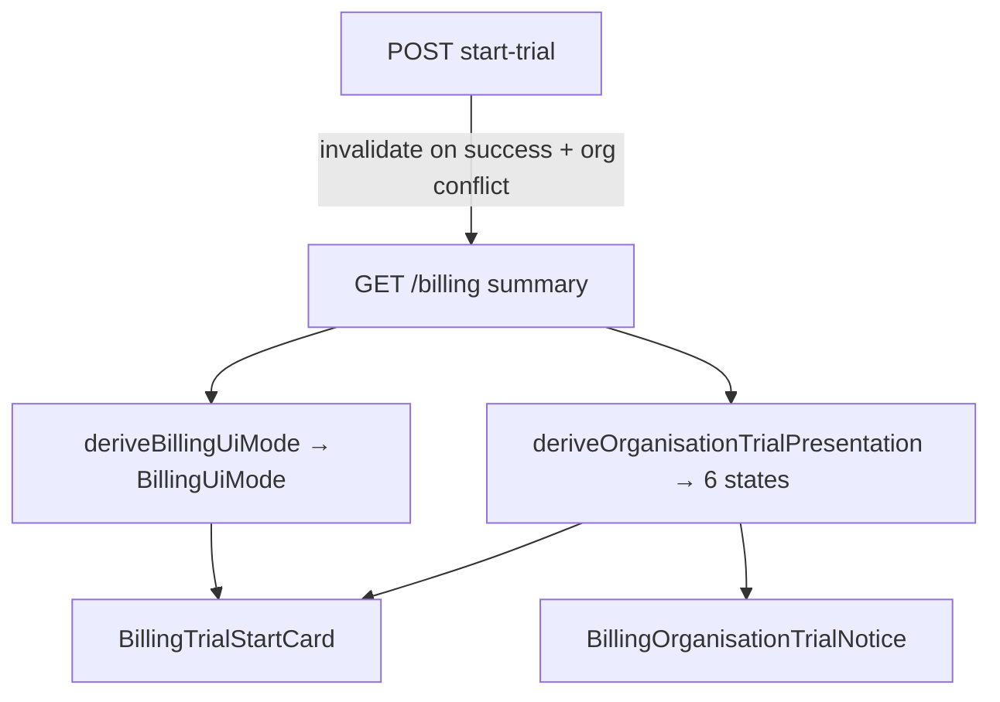

# Developer handoff — Organisation free trial (frontend)

Handoff for continuing the **permanent organisation-level free trial** integration. CMS/backend work is complete; frontend phases **APP-TRIAL-001 … 007**.

---

## Epic goal

Integrate the CMS contract so that:

- A club/association gets **one lifetime free trial** (org-scoped consumption).
- The app shows the **correct org state**, never exposes Start from bad/contradictory data, and **preserves paid-plan paths**.
- Final UI is driven by a **refreshed GET billing summary**, not client guesses.

**Route:** `/o/:accountId/billing`

**Architecture decision (do not undo):** Keep account billing lifecycle in existing `BillingUiMode`. Add a **separate** org-trial presentation model because CMS separates permanent consumption, allocation lifecycle, and action permission.

---

## Monday.com (planning source of truth)

| Item            | URL                                                                                                                                               | Status          |
| --------------- | ------------------------------------------------------------------------------------------------------------------------------------------------- | --------------- |
| **Parent epic** | [Organisation-wide free trial eligibility and billing UI states](https://trentnixons-team-company.monday.com/boards/5029957869/pulses/2795213602) | Working on it   |
| APP-TRIAL-001   | [Align billing types and fixtures](https://trentnixons-team-company.monday.com/boards/5029958325/pulses/2796511693)                               | **Done**        |
| APP-TRIAL-002   | [Fail-closed presentation derivation](https://trentnixons-team-company.monday.com/boards/5029958325/pulses/2796511073)                            | **Done**        |
| APP-TRIAL-003   | [Billing notices + overview integration](https://trentnixons-team-company.monday.com/boards/5029958325/pulses/2796499718)                         | **Done**        |
| APP-TRIAL-004   | [Start-trial success/idempotency/conflicts/refetch](https://trentnixons-team-company.monday.com/boards/5029958325/pulses/2796500136)              | **Done**        |
| APP-TRIAL-005   | [Remove client-derived pre-start dates](https://trentnixons-team-company.monday.com/boards/5029958325/pulses/2796511301)                          | **Done**        |
| APP-TRIAL-006   | [Route Lab + automated tests](https://trentnixons-team-company.monday.com/boards/5029958325/pulses/2796499688)                                    | **Done**        |
| APP-TRIAL-007   | [Staging QA + handoff](https://trentnixons-team-company.monday.com/boards/5029958325/pulses/2796500151)                                           | **Not started** |

The parent pulse update (“Frontend source of truth — final CMS contract”) is the authoritative frontend brief.

---

## CMS / backend contract (authoritative)

**Primary handoff (read first):**  
`D:\htdoc\Fixtura\Fixtura.com.au\Backend\.comms\accounts\handoff\cms-handoff-bill-trial-012-013-frontend-integration.md`

**Wire types (mirror exactly):**  
`D:\htdoc\Fixtura\Fixtura.com.au\Backend\src\api\account\types\billing-contract-v1.d.ts`

### GET billing — org trial block

```ts
organisationTrial: {
  consumptionStatus?: "available" | "used";
  allocationStatus?: "none" | "active_on_this_account" | "active_on_another_account" | "ended";
  canStartTrial: boolean;
}
```

- `availableActions.canStartTrial` **mirrors** `organisationTrial.canStartTrial` — authoritative for Start button.
- Account `trial` block is **account-scoped only**; wire field is `trial.isEligible` (not `eligible`).
- Fail-closed: unresolved org → only `{ canStartTrial: false }`; status fields omitted.

### POST start-trial

- Body: `{}`
- Success: `{ trialId, status: "started" | "already_active", message? }`
- Stable errors: `TRIAL_ALREADY_CONSUMED`, `TRIAL_ORGANISATION_UNAVAILABLE`, `TRIAL_ALLOCATION_DISABLED` (409/503)
- After any success **or org conflict**: invalidate/refetch GET billing; branch on `error.code`, not message text.

---

## Two-layer architecture (current)



| Layer   | Module                                | Purpose                                                                                                               |
| ------- | ------------------------------------- | --------------------------------------------------------------------------------------------------------------------- |
| Account | `deriveBillingUiMode`                 | `paid_active`, `payment_pending`, `free_trial_available`, `active_trial`, etc.                                        |
| Org     | `deriveOrganisationTrialPresentation` | `start_available`, `active_on_this_account`, `active_on_another_account`, `used`, `blocked_by_billing`, `unavailable` |

**Precedence:** `paid_active` and `payment_pending` suppress org-trial notices. Start requires **both** `billingUiMode === "free_trial_available"` **and** `presentation === "start_available"`.

---

## What is done (001–006)

### APP-TRIAL-001 — Types + fixtures

- Production types in [`src/types/api/account.ts`](../../../../../../../types/api/account.ts): `OrganisationTrialBlock`, `trial.isEligible`, frozen start-trial response/error unions.
- Route Lab fixtures include `organisationTrial`.

### APP-TRIAL-002 — Pure derivation + debug

| File                                                                                                            | Purpose                                    |
| --------------------------------------------------------------------------------------------------------------- | ------------------------------------------ |
| [`_types/trial/organisationTrialPresentation.ts`](../_types/trial/organisationTrialPresentation.ts)             | Six-state union                            |
| [`_utils/trial/deriveOrganisationTrialPresentation.ts`](../_utils/trial/deriveOrganisationTrialPresentation.ts) | Fail-closed derivation                     |
| [`deriveOrganisationTrialPresentation.test.ts`](../_utils/trial/deriveOrganisationTrialPresentation.test.ts)    | 14 unit tests                              |
| Debug panel                                                                                                     | Org trial section at `?debug=1` on billing |

### APP-TRIAL-003 — Billing notices + overview

- [`overview/_hooks/useBillingOverviewContentState.ts`](../overview/_hooks/useBillingOverviewContentState.ts) exposes `organisationTrialPresentation`.
- [`BillingOrganisationTrialNotice.tsx`](../_components/trial/BillingOrganisationTrialNotice.tsx) — used / active-elsewhere / unavailable notices.
- [`BillingContent.tsx`](../overview/_components/BillingContent.tsx) wires notices + Start gating.
- Org notices suppressed under `paid_active` / `payment_pending`.

### APP-TRIAL-004 — Mutation + refetch

- Stable org error codes in [`billingTrialStart.ts`](../_utils/trial/billingTrialStart.ts).
- [`usePostAccountBillingStartTrial.ts`](../../../../../../../lib/api/hooks/account/usePostAccountBillingStartTrial.ts) invalidates billing on success and org-conflict `onError`.
- 503 reads `details.error.code` with optional retry-after hint.

### APP-TRIAL-005 — Confirmation date accuracy

- Removed client-predicted Starts/Ends from pre-start confirm dialog.
- Confirm shows **duration + no-charge copy only** (14 days).
- Active trial dates come from CMS via [`BillingActiveTrialStatusCard.tsx`](../_components/overview/BillingActiveTrialStatusCard.tsx) after refetch.

### APP-TRIAL-006 — Route Lab + automated verification

**Route Lab fixtures** — six org scenarios in [`billing-lab-fixtures.ts`](../../../../../../../features/route-lab/billing/billing-lab-fixtures.ts):

| `state`                | Expected presentation       |
| ---------------------- | --------------------------- |
| `org_start_available`  | `start_available`           |
| `org_active_here`      | `active_on_this_account`    |
| `org_active_elsewhere` | `active_on_another_account` |
| `org_used`             | `used`                      |
| `org_blocked`          | `blocked_by_billing`        |
| `org_unavailable`      | `unavailable` (fail-closed) |

**Route Lab smoke URLs:**

- `/sandbox/route-lab/o/575/billing?state=org_start_available`
- `/sandbox/route-lab/o/575/billing?state=org_active_elsewhere`
- `/sandbox/route-lab/o/575/billing?state=org_unavailable`

---

## What is NOT done yet

1. **APP-TRIAL-007 — Staging QA** against live CMS (only remaining ticket).
2. **Frontend sign-off** — confirm no legacy `POST /trial-instances` usage in app (checklist in Backend handoff).
3. **Dashboard CTAs** outside billing overview — card may show “Start trial” label when `free_trial_available`; actual Start remains double-gated on billing overview.

---

## What is next — APP-TRIAL-007

**Goal:** Verify all scenarios against **staging CMS** and document frontend sign-off.

### QA matrix (run on staging `/o/:accountId/billing`)

| Scenario          | What to verify                                                          |
| ----------------- | ----------------------------------------------------------------------- |
| Eligible org      | Start visible; POST succeeds; refetch shows active trial with CMS dates |
| Active here       | No Start; active-trial UI with CMS dates                                |
| Active elsewhere  | Org notice; no Start; no other-account IDs exposed                      |
| Used (ended)      | Org notice; paid-plan CTAs when CMS allows                              |
| Unresolved org    | Fail-closed; support/unavailable notice; no Start                       |
| Billing-blocked   | No org notice; billing/checkout UX owns screen                          |
| Idempotent retry  | POST `already_active` → refetch; no duplicate UI                        |
| 503 kill-switch   | Stable copy + Retry-After when CMS returns `TRIAL_ALLOCATION_DISABLED`  |
| Org conflict race | POST `TRIAL_ALREADY_CONSUMED` → refetch replaces stale Start UI         |

### Touch points

- [`billing/.comms/resources/staging-qa-checklist.md`](../resources/staging-qa-checklist.md) — staging checklist with org-trial rows
- [`billing/.docs/Tickets.md`](../../.docs/Tickets.md) — APP-TRIAL-007 ticket
- Monday [APP-TRIAL-007](https://trentnixons-team-company.monday.com/boards/5029958325/pulses/2796500151)

---

## Where to find information

| Topic                               | Location                                                                                                              |
| ----------------------------------- | --------------------------------------------------------------------------------------------------------------------- |
| **Frontend epic brief + UI matrix** | Monday parent update on [2795213602](https://trentnixons-team-company.monday.com/boards/5029957869/pulses/2795213602) |
| **CMS integration handoff**         | `Backend\.comms\accounts\handoff\cms-handoff-bill-trial-012-013-frontend-integration.md`                              |
| **Frozen wire types**               | `Backend\src\api\account\types\billing-contract-v1.d.ts`                                                              |
| **App types (mirrored)**            | `application\src\types\api\account.ts`                                                                                |
| **Org derivation**                  | `billing\_utils\trial\deriveOrganisationTrialPresentation.ts`                                                         |
| **Overview gating**                 | `billing\_utils\trial\billingOrganisationTrialOverview.ts`                                                            |
| **Account UI mode**                 | `billing\_core\_utils\billing-state-derivation.ts`                                                                    |
| **Start trial UI**                  | `billing\_hooks\useBillingTrialStart.ts`, `billing\_components\trial\`                                                |
| **Mutation hook**                   | `src\lib\api\hooks\account\usePostAccountBillingStartTrial.ts`                                                        |
| **Route Lab fixtures**              | `src\features\route-lab\billing\billing-lab-fixtures.ts`                                                              |
| **Local billing docs**              | `billing\.docs\DevelopmentRoadMap.md`, `Tickets.md`, `Completed.md`                                                   |

---

## Tests to run when continuing

```bash
npm run typecheck

npx vitest run \
  "src/features/route-lab/billing/billing-lab-fixtures.test.ts" \
  "src/app/(members)/o/[accountId]/billing/_utils/trial/deriveOrganisationTrialPresentation.test.ts" \
  "src/app/(members)/o/[accountId]/billing/_utils/trial/billingOrganisationTrialOverview.test.ts" \
  "src/app/(members)/o/[accountId]/billing/_utils/trial/billingTrialStart.test.ts" \
  "src/app/(members)/o/[accountId]/billing/_utils/overview/billing-state.test.ts" \
  "src/app/(members)/o/[accountId]/billing/overview/_components/billing-content.test.tsx" \
  "src/app/(members)/o/[accountId]/billing/_components/trial/BillingTrialStartConfirmDialog.test.tsx" \
  "src/app/(members)/o/[accountId]/billing/_components/trial/BillingOrganisationTrialNotice.test.tsx" \
  "src/app/(members)/o/[accountId]/billing/_components/trial/BillingTrialStartCard.test.tsx" \
  "src/lib/api/hooks/account/usePostAccountBillingStartTrial.test.tsx" \
  "src/app/api/accounts/[accountId]/billing/start-trial/route.test.ts"
```

---

## Rules for the next LLM

1. **Do not conflate** `BillingUiMode` and `OrganisationTrialPresentation`.
2. **Fail closed** — missing/contradictory org data → no Start, show support/unavailable UX.
3. **Never expose** another account’s ID, user, email, or billing details.
4. **Branch errors on `error.code`**, not CMS message strings.
5. **Refetch GET billing** after start-trial outcomes; do not trust POST body for final UI.
6. **Minimize scope** — APP-TRIAL-007 is QA/sign-off only; do not rewrite billing-state derivation unless staging finds a real bug.
