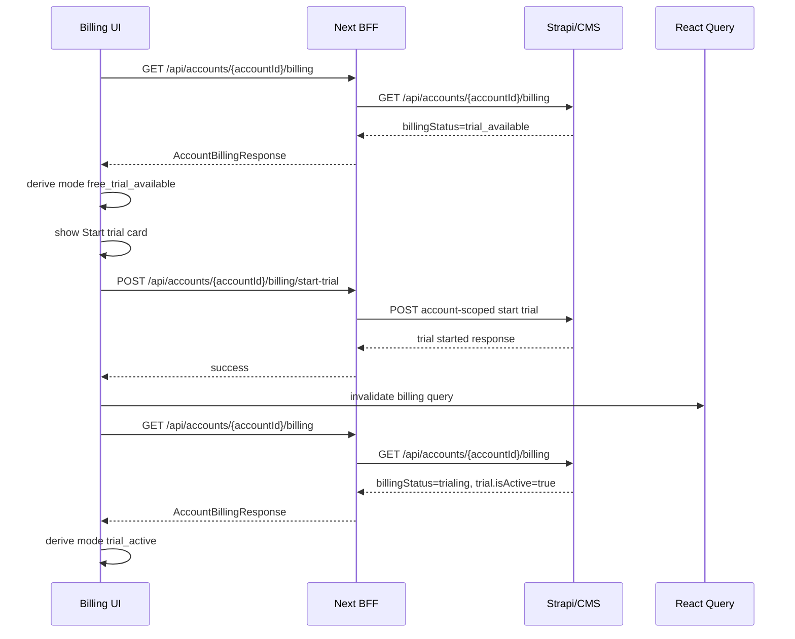

# Development implementation: free trial start flow

Date: 2026-05-05
Status: **Implemented** — production UI uses [`billing-state.ts`](../../billing-state.ts) (`deriveBillingUiMode`, `active_trial` mode name; planning doc historically said `trial_active`).
Route: `/o/{accountId}/billing`
Reference UI: `/sandbox/route-lab/o/575/billing?state=trial_available`

## Objective

Implement the production free trial flow on the members billing page.

Required user journey:

1. `GET /billing` returns a trial-available account state.
2. Billing UI shows a free trial card with a Start button, matching the route-lab pattern.
3. User clicks Start.
4. Frontend calls an account-scoped CMS endpoint to assign the free trial.
5. Frontend invalidates/refetches `GET /billing`.
6. Refreshed billing data returns an active trial state.
7. UI changes to `trial_active`: trial dates/access are shown and Start is hidden or disabled.

The frontend must never locally flip billing entitlement. Button clicks trigger mutations and refetches; the refreshed CMS response decides the final UI.

## Implementation summary

Add:

- A trial UI mode helper.
- A BFF route for starting a trial, once the CMS path is confirmed.
- An `accountApi` method.
- A React Query mutation hook.
- A `BillingTrialStartCard` client component.
- Billing UI wiring that shows the card for `trial_available` and active trial details for `trial_active`.

Update:

- Types for the start-trial response/request if CMS returns more than a minimal response.
- Route definitions with the new account billing trial-start route.
- Billing labels for confirmed CMS trial statuses.
- Staging QA checklist after implementation.

## Data flow



## CMS contract to confirm

Confirm these before coding the BFF path.

### Trial available response

Expected shape from `GET /api/accounts/{accountId}/billing`:

```json
{
  "data": {
    "billingStatus": "trial_available",
    "accessStatus": "pending",
    "currentPlan": null,
    "trial": {
      "id": null,
      "startDate": null,
      "endDate": null,
      "isActive": false,
      "eligible": true,
      "subscriptionTier": null
    },
    "activeOrder": null,
    "latestInvoiceRequest": null,
    "availableActions": {
      "canStartTrial": true
    }
  }
}
```

### Trial active response

Expected shape after Start + refetch:

```json
{
  "data": {
    "billingStatus": "trialing",
    "accessStatus": "active",
    "currentPlan": null,
    "trial": {
      "id": 123,
      "startDate": "2026-05-05T00:00:00.000Z",
      "endDate": "2026-05-19T00:00:00.000Z",
      "isActive": true,
      "eligible": false,
      "subscriptionTier": null
    },
    "activeOrder": null,
    "latestInvoiceRequest": null,
    "availableActions": {
      "canStartTrial": false
    }
  }
}
```

### Start-trial endpoint

Preferred application endpoint:

```http
POST /api/accounts/{accountId}/billing/start-trial
```

Preferred Strapi endpoint behind the BFF:

```http
POST {STRAPI_URL}/api/accounts/{accountId}/billing/start-trial
Authorization: Bearer <jwt>
```

Acceptable alternative if CMS chooses a different name:

```http
POST /api/accounts/{accountId}/billing/trial
```

Expected response:

```ts
export interface StartAccountBillingTrialResponse {
  trialId?: string | number;
  status: "started";
  message?: string;
}
```

If CMS returns the full billing summary instead, still invalidate/refetch `GET /billing` so the UI remains consistent with the existing billing data flow.

## Files to add or update

### 1. Trial mode helper

Add:

`src/app/(members)/o/[accountId]/billing/billing-ui-mode.ts`

Implementation:

```ts
import type { AccountBillingSummaryV1 } from "@/types/api/account";

export type BillingUiMode =
  | "free_trial_available"
  | "trial_active"
  | "trial_expired"
  | "paid_active"
  | "invoice_pending"
  | "payment_required"
  | "access_unavailable"
  | "unknown";

export function deriveBillingUiMode(summary: AccountBillingSummaryV1): BillingUiMode {
  // Implement from confirmed CMS status values.
}
```

Detection rules:

- `paid_active`: `activeOrder?.isActive === true` or confirmed paid-active CMS statuses.
- `free_trial_available`: trial eligible, not active, and `canStartTrial` or `can_start_trial` is true.
- `trial_active`: `trial?.isActive === true` and access status is active/available/trial.
- `invoice_pending`: latest invoice request has submitted/pending status.
- `trial_expired`: trial exists, not active, and no active paid order.
- `payment_required`: no active trial/order and CMS indicates payment needed.
- `access_unavailable`: CMS access status is denied/locked/none.
- `unknown`: fallback.

Keep this helper pure.

### 2. Start-trial action helper

Add action-key helpers near the billing UI code or in `billing-ui-mode.ts`.

Required behavior:

```ts
export function canStartTrial(actions?: Partial<Record<string, boolean>>): boolean {
  return actions?.canStartTrial === true || actions?.can_start_trial === true;
}
```

Do not treat missing/empty `availableActions` as permission to start a trial. Starting a free trial assigns entitlement and should require an explicit CMS action flag.

### 3. BFF route

Add after CMS endpoint is confirmed:

`src/app/api/accounts/[accountId]/billing/start-trial/route.ts`

Pattern:

- Same auth/account guard as the other billing BFF routes.
- Forward bearer token from cookie session.
- Validate `accountId`.
- Return 401/400/500 consistently with existing billing routes.
- Forward Strapi JSON response.
- Preserve Strapi status code on expected errors.

Use existing helper:

`src/app/api/accounts/[accountId]/billing/_billing-strapi-proxy.ts`

Update `AccountBillingStrapiSubpath` to include:

```ts
"start-trial";
```

If CMS chooses `trial`, add that exact path instead.

### 4. Route registry

Update:

`src/lib/api/routes/route-definitions.ts`

Add account billing route:

```ts
billingStartTrial: {
  key: "accounts.billing-start-trial",
  method: "POST",
  path: ACCOUNTS_API_BASE,
  authRequired: true,
  status: "ready",
  description:
    "POST append /{accountId}/billing/start-trial - assign a free trial to an eligible account",
  domain: "account",
}
```

Keep the existing guardrail against legacy `/orders` and `/subscription-tiers`.

### 5. Types

Update:

`src/types/api/account.ts`

Add:

```ts
export interface StartAccountBillingTrialResponse {
  trialId?: string | number;
  status: "started";
  message?: string;
}
```

If CMS requires a request body, add:

```ts
export interface StartAccountBillingTrialRequest {
  // Prefer empty body unless CMS needs a tier, reason, or source.
}
```

Also check whether `BillingTrialSummaryV1` needs `eligible` vs `isEligible` compatibility after staging response is known.

### 6. accountApi method

Update:

`src/lib/api/services/account.api.ts`

Add:

```ts
postAccountBillingStartTrial: (accountId: string) => {
  const path = `${appRoutes.accounts.billingStartTrial.path}/${encodeURIComponent(accountId)}/billing/start-trial`;
  return apiClient.post<StartAccountBillingTrialResponse>(path, {});
};
```

If empty request bodies are not desired by `apiClient`, use the established local pattern for no-body POSTs.

### 7. Mutation hook

Add:

`src/lib/api/hooks/account/usePostAccountBillingStartTrial.ts`

Implementation:

```ts
export function usePostAccountBillingStartTrial(accountId: string) {
  const queryClient = useQueryClient();

  return useMutation({
    mutationFn: () => accountApi.postAccountBillingStartTrial(accountId),
    onSuccess: async () => {
      await queryClient.invalidateQueries({ queryKey: queryKeys.account.billing(accountId) });
    },
  });
}
```

Do not set local billing state in the hook.

### 8. Trial start card

Add:

`src/app/(members)/o/[accountId]/billing/billing-trial-start-card.tsx`

Component contract:

```ts
export type BillingTrialStartCardProps = {
  accountId: string;
  enabled: boolean;
  availableActions?: Partial<Record<string, boolean>>;
};
```

Behavior:

- Render only when `enabled` and `canStartTrial(availableActions)` are true.
- Match the route-lab `trial_available` card pattern:
  - small "Free trial" label
  - headline such as "Try Fixtura free"
  - short no-payment explanation
  - Start button
- On click:
  - clear old messages
  - call `usePostAccountBillingStartTrial`
  - show pending state on the button
  - show success message from CMS if present
  - rely on query invalidation/refetch for the UI transition
- On error:
  - show `ApiError.message`
  - fallback to network error message

Suggested button copy:

- idle: `Start free trial`
- pending: `Starting trial...`

### 9. Billing content wiring

Update:

`src/app/(members)/o/[accountId]/billing/billing-content.tsx`

Use:

```ts
const mode = deriveBillingUiMode(q.data.data);
```

Render order after successful billing load:

1. Checkout return banner if present.
2. Billing summary sections.
3. If `mode === "free_trial_available"`, render `BillingTrialStartCard`.
4. If `mode !== "free_trial_available"`, allow checkout and invoice forms according to CMS actions.

Recommended first pass:

- Hide `BillingPlanCheckout` and `BillingInvoiceRequest` while `free_trial_available` is active, unless CMS/Product explicitly asks for those actions to appear beside Start.
- Once `trial_active`, keep Start hidden and let checkout/invoice be controlled by `availableActions`.

### 10. Labels

Update:

`src/app/(members)/o/[accountId]/billing/billing-summary-labels.ts`

Add confirmed mappings after staging/CMS confirmation:

```ts
trial_available: "Trial available",
trialing: "Trial active",
trial_active: "Trial active",
trial_ended: "Trial ended",
```

Access labels may need:

```ts
pending: "Pending",
active: "Active",
trial: "Trial access",
```

Badge behavior:

- `trial_active` / `trialing` access should not use destructive styling.
- `trial_available` should probably be outline until access is active.

## UI states

### free_trial_available

Show:

- billing status label
- current plan empty state
- free trial Start card

Hide:

- active order card, unless CMS returns one
- Start button after mutation begins only while pending
- checkout/invoice forms unless explicitly enabled by Product/CMS for this mode

### trial_active

Show:

- trial status as active
- access as active/available/trial
- trial dates
- days remaining if available
- checkout/invoice forms only if CMS action flags allow them

Hide:

- free trial Start card
- paid plan/order claims unless CMS returns paid plan/order data

### Error and pending states

Start click pending:

- Disable Start button.
- Keep card visible.
- Button text: `Starting trial...`

Start failure:

- Keep `free_trial_available`.
- Show inline error.
- Re-enable Start if action is still available.

Start success but refetch still returns `trial_available`:

- Show CMS success message if available.
- Keep UI data-driven.
- Do not force active trial UI.

## Verification

Run:

```powershell
npm run typecheck
npx eslint 'src/app/(members)/o/[accountId]/billing/billing-content.tsx' 'src/app/(members)/o/[accountId]/billing/billing-trial-start-card.tsx' 'src/app/(members)/o/[accountId]/billing/billing-ui-mode.ts' 'src/lib/api/hooks/account/usePostAccountBillingStartTrial.ts'
```

Manual staging checks:

- Trial available account shows Start card.
- Start button calls the account-scoped CMS endpoint.
- Start pending state disables duplicate clicks.
- Start success invalidates/refetches `GET /billing`.
- UI changes to active trial only after `GET /billing` returns active trial data.
- Start card is hidden or disabled in active trial mode.
- Trial dates render correctly.
- Checkout and invoice actions follow `availableActions`.
- No legacy `/orders` or `/subscription-tiers` routes are introduced.

## Implementation blockers

Do not implement the BFF route until CMS confirms:

- exact start-trial endpoint path
- whether request body is empty
- response shape
- exact `billingStatus` and `accessStatus` values before and after Start
- exact action flag name for trial start

## Acceptance criteria

- `trial_available` is detected from live `GET /billing`.
- UI shows a route-lab-style free trial card with Start button.
- Start button is visible only when CMS says trial can be started.
- Start button calls the account-scoped CMS endpoint.
- Successful Start invalidates/refetches billing.
- `trial_active` UI is shown only from refreshed CMS billing data.
- Active trial shows available access and trial dates.
- Paid plan/order UI is not shown unless CMS returns paid plan/order data.
- Unknown CMS statuses render safely.
